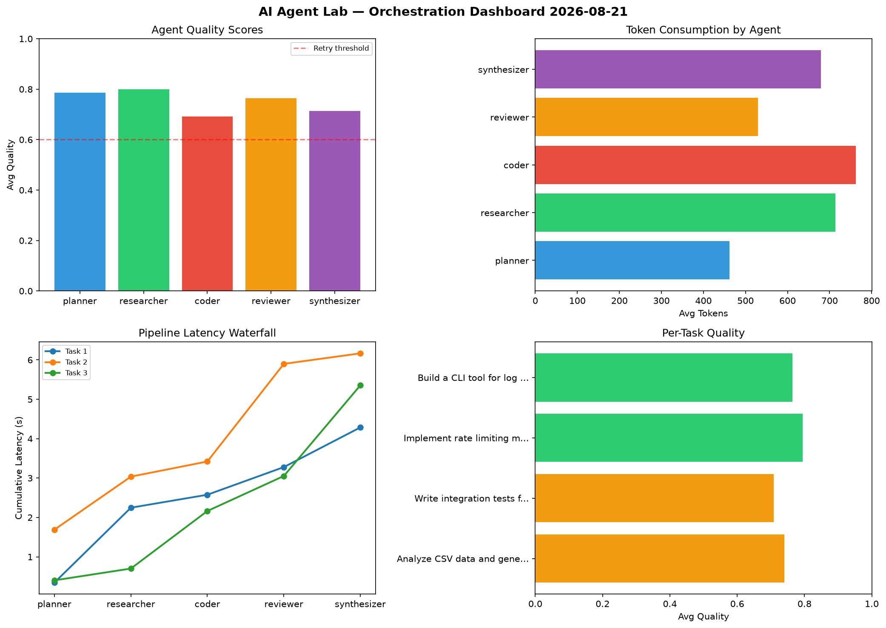

# AI Agent Lab — Orchestration Report 2026-08-21

**Run ID:** `7e4ca7fd41` | **Tasks:** 4 | **Avg Quality:** 0.752

## Aggregate Metrics

| Metric | Value |
|--------|-------|
| avg_latency | 5.886 |
| total_tokens | 12588 |
| avg_quality | 0.752 |

## Delta vs Yesterday

| Metric | Today | Yesterday | Change |
|--------|-------|-----------|--------|
| avg_latency | 5.886 | 6.0 | 📉 -1.9% |
| total_tokens | 12588 | 14542 | 📉 -13.4% |
| avg_quality | 0.752 | 0.746 | 📈 0.8% |

## Pipeline Results

### Analyze CSV data and generate statistical summary
| Agent | Quality | Latency | Tokens | Status |
|-------|---------|---------|--------|--------|
| planner | 0.671 | 0.345s | 699 | success |
| researcher | 0.916 | 1.902s | 626 | success |
| coder | 0.822 | 0.329s | 846 | success |
| reviewer | 0.68 | 0.702s | 222 | success |
| synthesizer | 0.61 | 1.007s | 726 | success |

### Write integration tests for payment processing module
| Agent | Quality | Latency | Tokens | Status |
|-------|---------|---------|--------|--------|
| planner | 0.867 | 1.69s | 379 | success |
| researcher | 0.778 | 1.346s | 1156 | success |
| coder | 0.505 | 0.384s | 1030 | needs_retry |
| reviewer | 0.766 | 2.479s | 585 | success |
| synthesizer | 0.624 | 0.267s | 569 | success |

### Implement rate limiting middleware
| Agent | Quality | Latency | Tokens | Status |
|-------|---------|---------|--------|--------|
| planner | 0.782 | 0.403s | 268 | success |
| researcher | 0.627 | 0.299s | 612 | success |
| coder | 0.791 | 1.461s | 431 | success |
| reviewer | 0.982 | 0.889s | 909 | success |
| synthesizer | 0.786 | 2.301s | 749 | success |

### Build a CLI tool for log analysis
| Agent | Quality | Latency | Tokens | Status |
|-------|---------|---------|--------|--------|
| planner | 0.828 | 1.161s | 503 | success |
| researcher | 0.88 | 2.344s | 461 | success |
| coder | 0.646 | 1.353s | 742 | success |
| reviewer | 0.627 | 1.728s | 401 | success |
| synthesizer | 0.837 | 1.153s | 674 | success |
