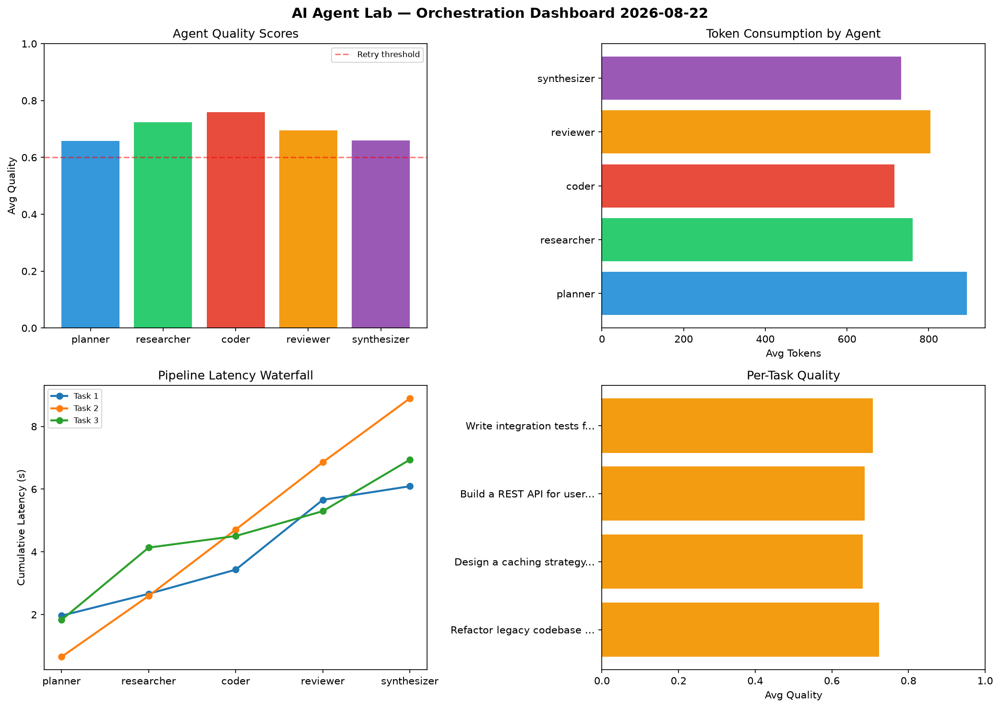

# AI Agent Lab — Orchestration Report 2026-08-22

**Run ID:** `310a7c24bc` | **Tasks:** 4 | **Avg Quality:** 0.699

## Aggregate Metrics

| Metric | Value |
|--------|-------|
| avg_latency | 6.626 |
| total_tokens | 15628 |
| avg_quality | 0.699 |

## Delta vs Yesterday

| Metric | Today | Yesterday | Change |
|--------|-------|-----------|--------|
| avg_latency | 6.626 | 5.886 | 📈 12.6% |
| total_tokens | 15628 | 12588 | 📈 24.1% |
| avg_quality | 0.699 | 0.752 | 📉 -7.0% |

## Pipeline Results

### Refactor legacy codebase to use dependency injection
| Agent | Quality | Latency | Tokens | Status |
|-------|---------|---------|--------|--------|
| planner | 0.687 | 1.964s | 715 | success |
| researcher | 0.572 | 0.697s | 317 | needs_retry |
| coder | 0.763 | 0.77s | 1077 | success |
| reviewer | 0.862 | 2.229s | 521 | success |
| synthesizer | 0.731 | 0.433s | 771 | success |

### Design a caching strategy for high-traffic endpoints
| Agent | Quality | Latency | Tokens | Status |
|-------|---------|---------|--------|--------|
| planner | 0.566 | 0.651s | 824 | needs_retry |
| researcher | 0.833 | 1.942s | 1069 | success |
| coder | 0.651 | 2.117s | 526 | success |
| reviewer | 0.763 | 2.148s | 544 | success |
| synthesizer | 0.592 | 2.038s | 609 | needs_retry |

### Build a REST API for user authentication
| Agent | Quality | Latency | Tokens | Status |
|-------|---------|---------|--------|--------|
| planner | 0.841 | 1.83s | 1240 | success |
| researcher | 0.524 | 2.305s | 664 | needs_retry |
| coder | 0.722 | 0.37s | 333 | success |
| reviewer | 0.639 | 0.793s | 948 | success |
| synthesizer | 0.705 | 1.642s | 701 | success |

### Write integration tests for payment processing module
| Agent | Quality | Latency | Tokens | Status |
|-------|---------|---------|--------|--------|
| planner | 0.541 | 0.458s | 795 | needs_retry |
| researcher | 0.964 | 0.724s | 995 | success |
| coder | 0.904 | 0.429s | 928 | success |
| reviewer | 0.515 | 2.332s | 1203 | needs_retry |
| synthesizer | 0.609 | 0.632s | 848 | success |
