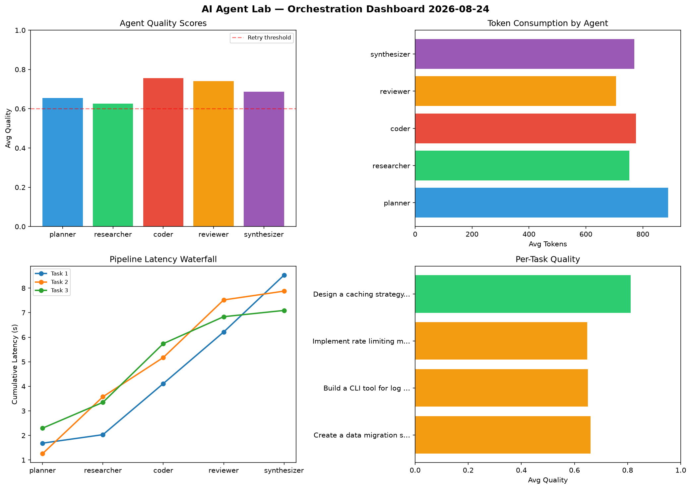

# AI Agent Lab — Orchestration Report 2026-08-24

**Run ID:** `448b4ea66a` | **Tasks:** 4 | **Avg Quality:** 0.693

## Aggregate Metrics

| Metric | Value |
|--------|-------|
| avg_latency | 7.87 |
| total_tokens | 15571 |
| avg_quality | 0.693 |

## Delta vs Yesterday

| Metric | Today | Yesterday | Change |
|--------|-------|-----------|--------|
| avg_latency | 7.87 | 7.477 | 📈 5.3% |
| total_tokens | 15571 | 12987 | 📈 19.9% |
| avg_quality | 0.693 | 0.745 | 📉 -7.0% |

## Pipeline Results

### Create a data migration script for schema v2
| Agent | Quality | Latency | Tokens | Status |
|-------|---------|---------|--------|--------|
| planner | 0.718 | 1.686s | 981 | success |
| researcher | 0.522 | 0.346s | 389 | needs_retry |
| coder | 0.584 | 2.079s | 669 | needs_retry |
| reviewer | 0.898 | 2.1s | 921 | success |
| synthesizer | 0.582 | 2.316s | 755 | needs_retry |

### Build a CLI tool for log analysis
| Agent | Quality | Latency | Tokens | Status |
|-------|---------|---------|--------|--------|
| planner | 0.62 | 1.258s | 852 | success |
| researcher | 0.691 | 2.318s | 1028 | success |
| coder | 0.668 | 1.597s | 763 | success |
| reviewer | 0.537 | 2.344s | 901 | needs_retry |
| synthesizer | 0.733 | 0.359s | 658 | success |

### Implement rate limiting middleware
| Agent | Quality | Latency | Tokens | Status |
|-------|---------|---------|--------|--------|
| planner | 0.577 | 2.296s | 927 | needs_retry |
| researcher | 0.542 | 1.052s | 1112 | needs_retry |
| coder | 0.93 | 2.39s | 577 | success |
| reviewer | 0.556 | 1.097s | 553 | needs_retry |
| synthesizer | 0.633 | 0.255s | 975 | success |

### Design a caching strategy for high-traffic endpoints
| Agent | Quality | Latency | Tokens | Status |
|-------|---------|---------|--------|--------|
| planner | 0.704 | 1.455s | 795 | success |
| researcher | 0.747 | 1.743s | 481 | success |
| coder | 0.838 | 1.917s | 1093 | success |
| reviewer | 0.974 | 1.2s | 448 | success |
| synthesizer | 0.796 | 1.674s | 693 | success |
