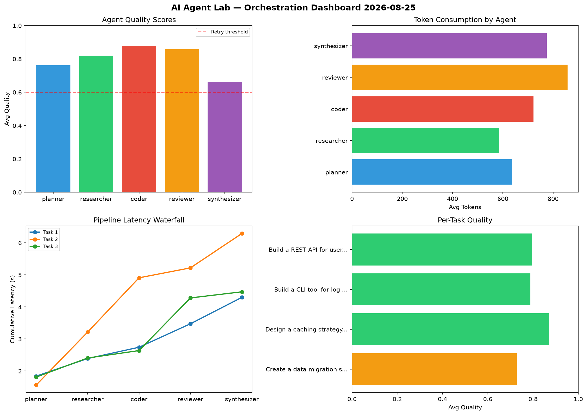

# AI Agent Lab — Orchestration Report 2026-08-25

**Run ID:** `5cb69905eb` | **Tasks:** 4 | **Avg Quality:** 0.796

## Aggregate Metrics

| Metric | Value |
|--------|-------|
| avg_latency | 5.319 |
| total_tokens | 14305 |
| avg_quality | 0.796 |

## Delta vs Yesterday

| Metric | Today | Yesterday | Change |
|--------|-------|-----------|--------|
| avg_latency | 5.319 | 7.87 | 📉 -32.4% |
| total_tokens | 14305 | 15571 | 📉 -8.1% |
| avg_quality | 0.796 | 0.693 | 📈 14.9% |

## Pipeline Results

### Create a data migration script for schema v2
| Agent | Quality | Latency | Tokens | Status |
|-------|---------|---------|--------|--------|
| planner | 0.832 | 1.84s | 725 | success |
| researcher | 0.77 | 0.549s | 508 | success |
| coder | 0.726 | 0.353s | 718 | success |
| reviewer | 0.714 | 0.733s | 732 | success |
| synthesizer | 0.598 | 0.824s | 645 | needs_retry |

### Design a caching strategy for high-traffic endpoints
| Agent | Quality | Latency | Tokens | Status |
|-------|---------|---------|--------|--------|
| planner | 0.902 | 1.563s | 789 | success |
| researcher | 0.908 | 1.651s | 546 | success |
| coder | 0.936 | 1.696s | 1014 | success |
| reviewer | 0.899 | 0.31s | 1009 | success |
| synthesizer | 0.714 | 1.073s | 824 | success |

### Build a CLI tool for log analysis
| Agent | Quality | Latency | Tokens | Status |
|-------|---------|---------|--------|--------|
| planner | 0.766 | 1.811s | 188 | success |
| researcher | 0.886 | 0.595s | 1054 | success |
| coder | 0.89 | 0.232s | 634 | success |
| reviewer | 0.832 | 1.644s | 842 | success |
| synthesizer | 0.568 | 0.191s | 730 | needs_retry |

### Build a REST API for user authentication
| Agent | Quality | Latency | Tokens | Status |
|-------|---------|---------|--------|--------|
| planner | 0.551 | 0.622s | 844 | needs_retry |
| researcher | 0.718 | 1.305s | 233 | success |
| coder | 0.95 | 1.901s | 523 | success |
| reviewer | 0.991 | 2.278s | 846 | success |
| synthesizer | 0.773 | 0.105s | 901 | success |
