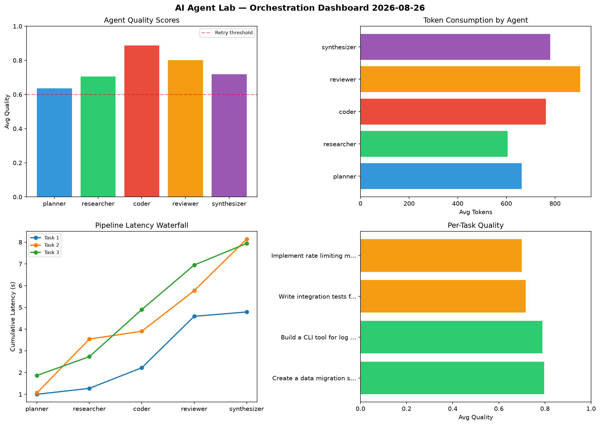

# AI Agent Lab — Orchestration Report 2026-08-26

**Run ID:** `9e4b184800` | **Tasks:** 4 | **Avg Quality:** 0.75

## Aggregate Metrics

| Metric | Value |
|--------|-------|
| avg_latency | 7.29 |
| total_tokens | 14860 |
| avg_quality | 0.75 |

## Delta vs Yesterday

| Metric | Today | Yesterday | Change |
|--------|-------|-----------|--------|
| avg_latency | 7.29 | 5.744 | 📈 26.9% |
| total_tokens | 14860 | 13992 | 📈 6.2% |
| avg_quality | 0.75 | 0.77 | 📉 -2.6% |

## Pipeline Results

### Create a data migration script for schema v2
| Agent | Quality | Latency | Tokens | Status |
|-------|---------|---------|--------|--------|
| planner | 0.751 | 1.002s | 403 | success |
| researcher | 0.906 | 0.274s | 278 | success |
| coder | 0.944 | 0.947s | 696 | success |
| reviewer | 0.715 | 2.366s | 711 | success |
| synthesizer | 0.662 | 0.2s | 864 | success |

### Build a CLI tool for log analysis
| Agent | Quality | Latency | Tokens | Status |
|-------|---------|---------|--------|--------|
| planner | 0.698 | 1.071s | 890 | success |
| researcher | 0.576 | 2.47s | 945 | needs_retry |
| coder | 0.968 | 0.362s | 634 | success |
| reviewer | 0.9 | 1.867s | 886 | success |
| synthesizer | 0.802 | 2.37s | 465 | success |

### Write integration tests for payment processing module
| Agent | Quality | Latency | Tokens | Status |
|-------|---------|---------|--------|--------|
| planner | 0.52 | 1.87s | 679 | needs_retry |
| researcher | 0.614 | 0.864s | 397 | success |
| coder | 0.738 | 2.166s | 1198 | success |
| reviewer | 0.983 | 2.048s | 1024 | success |
| synthesizer | 0.728 | 0.992s | 1146 | success |

### Implement rate limiting middleware
| Agent | Quality | Latency | Tokens | Status |
|-------|---------|---------|--------|--------|
| planner | 0.575 | 0.987s | 679 | needs_retry |
| researcher | 0.724 | 2.256s | 802 | success |
| coder | 0.902 | 2.195s | 523 | success |
| reviewer | 0.61 | 0.569s | 992 | success |
| synthesizer | 0.682 | 2.286s | 648 | success |
