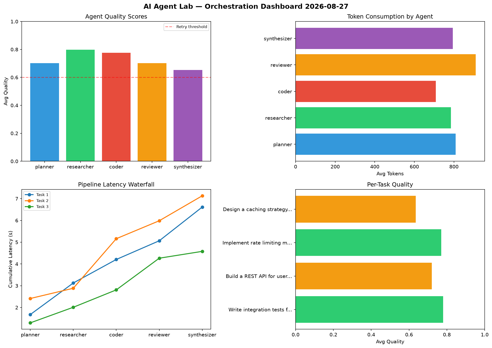

# AI Agent Lab — Orchestration Report 2026-08-27

**Run ID:** `3cd284d3ba` | **Tasks:** 4 | **Avg Quality:** 0.727

## Aggregate Metrics

| Metric | Value |
|--------|-------|
| avg_latency | 5.381 |
| total_tokens | 16025 |
| avg_quality | 0.727 |

## Delta vs Yesterday

| Metric | Today | Yesterday | Change |
|--------|-------|-----------|--------|
| avg_latency | 5.381 | 6.251 | 📉 -13.9% |
| total_tokens | 16025 | 13593 | 📈 17.9% |
| avg_quality | 0.727 | 0.769 | 📉 -5.5% |

## Pipeline Results

### Write integration tests for payment processing module
| Agent | Quality | Latency | Tokens | Status |
|-------|---------|---------|--------|--------|
| planner | 0.775 | 1.676s | 747 | success |
| researcher | 0.951 | 1.45s | 1028 | success |
| coder | 0.961 | 1.08s | 724 | success |
| reviewer | 0.564 | 0.859s | 528 | needs_retry |
| synthesizer | 0.647 | 1.549s | 1108 | success |

### Build a REST API for user authentication
| Agent | Quality | Latency | Tokens | Status |
|-------|---------|---------|--------|--------|
| planner | 0.907 | 2.413s | 614 | success |
| researcher | 0.674 | 0.471s | 408 | success |
| coder | 0.794 | 2.277s | 1085 | success |
| reviewer | 0.593 | 0.824s | 906 | needs_retry |
| synthesizer | 0.633 | 1.147s | 1075 | success |

### Implement rate limiting middleware
| Agent | Quality | Latency | Tokens | Status |
|-------|---------|---------|--------|--------|
| planner | 0.619 | 1.294s | 1140 | success |
| researcher | 0.973 | 0.716s | 765 | success |
| coder | 0.639 | 0.799s | 428 | success |
| reviewer | 0.902 | 1.456s | 1083 | success |
| synthesizer | 0.717 | 0.314s | 406 | success |

### Design a caching strategy for high-traffic endpoints
| Agent | Quality | Latency | Tokens | Status |
|-------|---------|---------|--------|--------|
| planner | 0.508 | 0.223s | 733 | needs_retry |
| researcher | 0.596 | 0.152s | 937 | needs_retry |
| coder | 0.71 | 1.541s | 597 | success |
| reviewer | 0.75 | 0.9s | 1123 | success |
| synthesizer | 0.614 | 0.384s | 590 | success |
