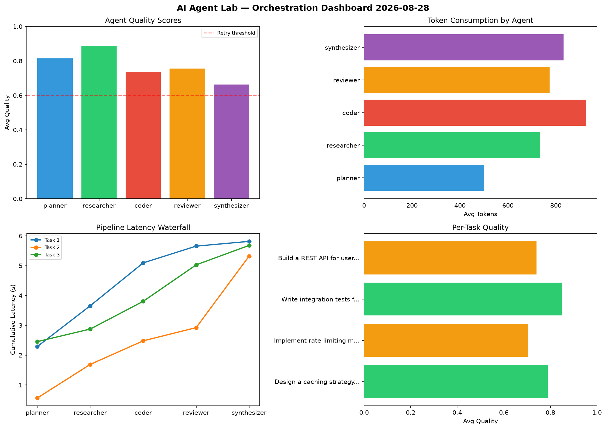

# AI Agent Lab — Orchestration Report 2026-08-28

**Run ID:** `6b23540c5f` | **Tasks:** 4 | **Avg Quality:** 0.771

## Aggregate Metrics

| Metric | Value |
|--------|-------|
| avg_latency | 6.218 |
| total_tokens | 15064 |
| avg_quality | 0.771 |

## Delta vs Yesterday

| Metric | Today | Yesterday | Change |
|--------|-------|-----------|--------|
| avg_latency | 6.218 | 6.957 | 📉 -10.6% |
| total_tokens | 15064 | 14595 | 📈 3.2% |
| avg_quality | 0.771 | 0.74 | 📈 4.2% |

## Pipeline Results

### Design a caching strategy for high-traffic endpoints
| Agent | Quality | Latency | Tokens | Status |
|-------|---------|---------|--------|--------|
| planner | 0.514 | 2.288s | 768 | needs_retry |
| researcher | 0.988 | 1.369s | 529 | success |
| coder | 0.629 | 1.437s | 902 | success |
| reviewer | 0.852 | 0.562s | 621 | success |
| synthesizer | 0.962 | 0.159s | 973 | success |

### Implement rate limiting middleware
| Agent | Quality | Latency | Tokens | Status |
|-------|---------|---------|--------|--------|
| planner | 0.964 | 0.563s | 753 | success |
| researcher | 0.636 | 1.127s | 313 | success |
| coder | 0.874 | 0.79s | 1168 | success |
| reviewer | 0.553 | 0.443s | 1112 | needs_retry |
| synthesizer | 0.501 | 2.397s | 549 | needs_retry |

### Write integration tests for payment processing module
| Agent | Quality | Latency | Tokens | Status |
|-------|---------|---------|--------|--------|
| planner | 0.983 | 2.454s | 271 | success |
| researcher | 0.969 | 0.421s | 1124 | success |
| coder | 0.937 | 0.93s | 965 | success |
| reviewer | 0.678 | 1.223s | 864 | success |
| synthesizer | 0.682 | 0.652s | 736 | success |

### Build a REST API for user authentication
| Agent | Quality | Latency | Tokens | Status |
|-------|---------|---------|--------|--------|
| planner | 0.797 | 0.979s | 212 | success |
| researcher | 0.957 | 2.238s | 971 | success |
| coder | 0.501 | 2.478s | 666 | needs_retry |
| reviewer | 0.938 | 1.577s | 497 | success |
| synthesizer | 0.506 | 0.785s | 1070 | needs_retry |
