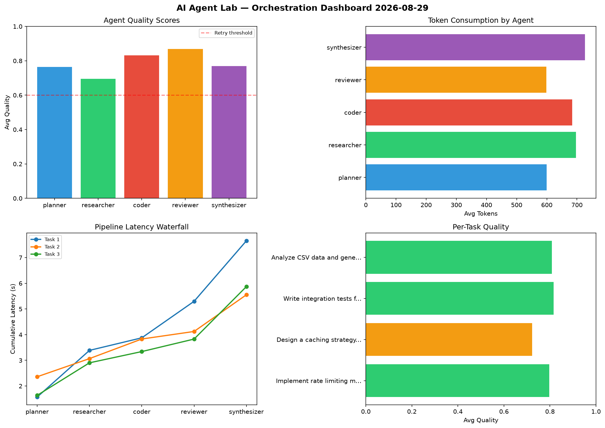

# AI Agent Lab — Orchestration Report 2026-08-29

**Run ID:** `90511f572b` | **Tasks:** 4 | **Avg Quality:** 0.786

## Aggregate Metrics

| Metric | Value |
|--------|-------|
| avg_latency | 6.377 |
| total_tokens | 13223 |
| avg_quality | 0.786 |

## Delta vs Yesterday

| Metric | Today | Yesterday | Change |
|--------|-------|-----------|--------|
| avg_latency | 6.377 | 6.048 | 📈 5.4% |
| total_tokens | 13223 | 16544 | 📉 -20.1% |
| avg_quality | 0.786 | 0.681 | 📈 15.4% |

## Pipeline Results

### Implement rate limiting middleware
| Agent | Quality | Latency | Tokens | Status |
|-------|---------|---------|--------|--------|
| planner | 0.762 | 1.569s | 352 | success |
| researcher | 0.842 | 1.818s | 602 | success |
| coder | 0.826 | 0.489s | 678 | success |
| reviewer | 0.9 | 1.422s | 622 | success |
| synthesizer | 0.654 | 2.356s | 939 | success |

### Design a caching strategy for high-traffic endpoints
| Agent | Quality | Latency | Tokens | Status |
|-------|---------|---------|--------|--------|
| planner | 0.634 | 2.36s | 710 | success |
| researcher | 0.544 | 0.707s | 744 | needs_retry |
| coder | 0.847 | 0.763s | 773 | success |
| reviewer | 0.809 | 0.294s | 636 | success |
| synthesizer | 0.778 | 1.428s | 560 | success |

### Write integration tests for payment processing module
| Agent | Quality | Latency | Tokens | Status |
|-------|---------|---------|--------|--------|
| planner | 0.812 | 1.635s | 567 | success |
| researcher | 0.614 | 1.268s | 372 | success |
| coder | 0.848 | 0.438s | 774 | success |
| reviewer | 0.832 | 0.487s | 254 | success |
| synthesizer | 0.973 | 2.043s | 759 | success |

### Analyze CSV data and generate statistical summary
| Agent | Quality | Latency | Tokens | Status |
|-------|---------|---------|--------|--------|
| planner | 0.85 | 0.841s | 769 | success |
| researcher | 0.779 | 1.937s | 1070 | success |
| coder | 0.805 | 1.318s | 510 | success |
| reviewer | 0.936 | 1.219s | 883 | success |
| synthesizer | 0.669 | 1.118s | 649 | success |
