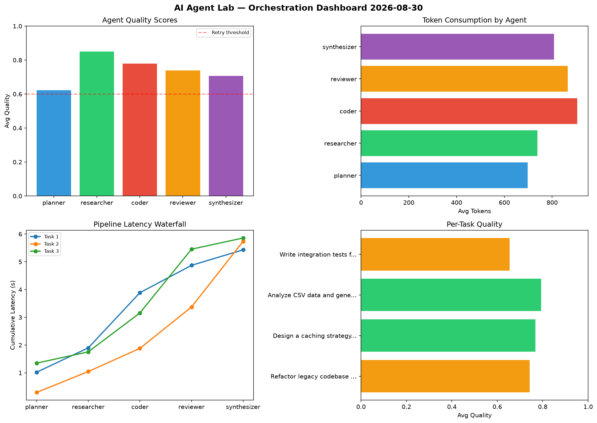

# AI Agent Lab — Orchestration Report 2026-08-30

**Run ID:** `0f6af48457` | **Tasks:** 4 | **Avg Quality:** 0.74

## Aggregate Metrics

| Metric | Value |
|--------|-------|
| avg_latency | 5.584 |
| total_tokens | 16055 |
| avg_quality | 0.74 |

## Delta vs Yesterday

| Metric | Today | Yesterday | Change |
|--------|-------|-----------|--------|
| avg_latency | 5.584 | 6.87 | 📉 -18.7% |
| total_tokens | 16055 | 13659 | 📈 17.5% |
| avg_quality | 0.74 | 0.771 | 📉 -4.0% |

## Pipeline Results

### Refactor legacy codebase to use dependency injection
| Agent | Quality | Latency | Tokens | Status |
|-------|---------|---------|--------|--------|
| planner | 0.509 | 1.024s | 1035 | needs_retry |
| researcher | 0.713 | 0.876s | 258 | success |
| coder | 0.784 | 1.987s | 589 | success |
| reviewer | 0.756 | 0.986s | 786 | success |
| synthesizer | 0.954 | 0.558s | 922 | success |

### Design a caching strategy for high-traffic endpoints
| Agent | Quality | Latency | Tokens | Status |
|-------|---------|---------|--------|--------|
| planner | 0.575 | 0.295s | 847 | needs_retry |
| researcher | 0.932 | 0.753s | 1061 | success |
| coder | 0.859 | 0.834s | 1096 | success |
| reviewer | 0.934 | 1.491s | 1135 | success |
| synthesizer | 0.542 | 2.363s | 1220 | needs_retry |

### Analyze CSV data and generate statistical summary
| Agent | Quality | Latency | Tokens | Status |
|-------|---------|---------|--------|--------|
| planner | 0.859 | 1.351s | 315 | success |
| researcher | 0.98 | 0.405s | 345 | success |
| coder | 0.955 | 1.403s | 838 | success |
| reviewer | 0.617 | 2.295s | 981 | success |
| synthesizer | 0.554 | 0.403s | 662 | needs_retry |

### Write integration tests for payment processing module
| Agent | Quality | Latency | Tokens | Status |
|-------|---------|---------|--------|--------|
| planner | 0.545 | 2.269s | 592 | needs_retry |
| researcher | 0.777 | 0.918s | 1288 | success |
| coder | 0.523 | 0.864s | 1098 | needs_retry |
| reviewer | 0.647 | 0.799s | 560 | success |
| synthesizer | 0.778 | 0.462s | 427 | success |
