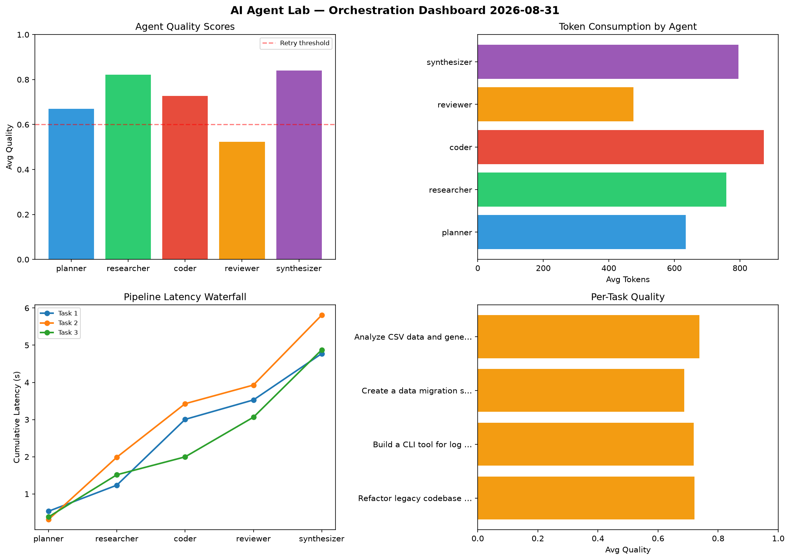

# AI Agent Lab — Orchestration Report 2026-08-31

**Run ID:** `975a46de99` | **Tasks:** 4 | **Avg Quality:** 0.716

## Aggregate Metrics

| Metric | Value |
|--------|-------|
| avg_latency | 5.251 |
| total_tokens | 14143 |
| avg_quality | 0.716 |

## Delta vs Yesterday

| Metric | Today | Yesterday | Change |
|--------|-------|-----------|--------|
| avg_latency | 5.251 | 6.206 | 📉 -15.4% |
| total_tokens | 14143 | 14645 | 📉 -3.4% |
| avg_quality | 0.716 | 0.738 | 📉 -3.0% |

## Pipeline Results

### Refactor legacy codebase to use dependency injection
| Agent | Quality | Latency | Tokens | Status |
|-------|---------|---------|--------|--------|
| planner | 0.629 | 0.535s | 1009 | success |
| researcher | 0.878 | 0.701s | 719 | success |
| coder | 0.745 | 1.769s | 889 | success |
| reviewer | 0.503 | 0.523s | 532 | needs_retry |
| synthesizer | 0.85 | 1.246s | 236 | success |

### Build a CLI tool for log analysis
| Agent | Quality | Latency | Tokens | Status |
|-------|---------|---------|--------|--------|
| planner | 0.647 | 0.312s | 594 | success |
| researcher | 0.817 | 1.676s | 775 | success |
| coder | 0.609 | 1.439s | 892 | success |
| reviewer | 0.524 | 0.502s | 360 | needs_retry |
| synthesizer | 1.0 | 1.881s | 845 | success |

### Create a data migration script for schema v2
| Agent | Quality | Latency | Tokens | Status |
|-------|---------|---------|--------|--------|
| planner | 0.871 | 0.382s | 624 | success |
| researcher | 0.699 | 1.134s | 746 | success |
| coder | 0.651 | 0.481s | 889 | success |
| reviewer | 0.523 | 1.067s | 631 | needs_retry |
| synthesizer | 0.691 | 1.812s | 946 | success |

### Analyze CSV data and generate statistical summary
| Agent | Quality | Latency | Tokens | Status |
|-------|---------|---------|--------|--------|
| planner | 0.532 | 1.915s | 310 | needs_retry |
| researcher | 0.889 | 0.908s | 793 | success |
| coder | 0.906 | 0.286s | 823 | success |
| reviewer | 0.544 | 1.717s | 376 | needs_retry |
| synthesizer | 0.82 | 0.718s | 1154 | success |
