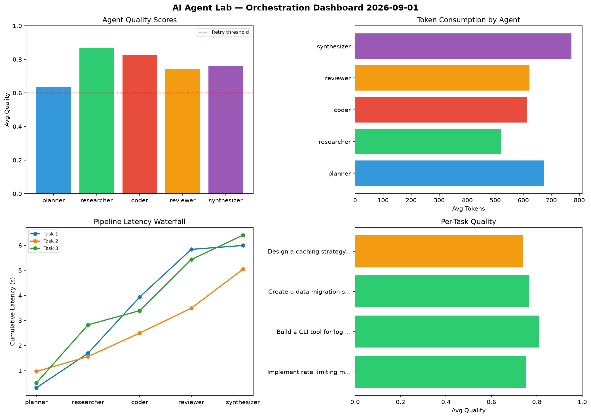

# AI Agent Lab — Orchestration Report 2026-09-01

**Run ID:** `1f5b0a285f` | **Tasks:** 4 | **Avg Quality:** 0.767

## Aggregate Metrics

| Metric | Value |
|--------|-------|
| avg_latency | 5.487 |
| total_tokens | 12805 |
| avg_quality | 0.767 |

## Delta vs Yesterday

| Metric | Today | Yesterday | Change |
|--------|-------|-----------|--------|
| avg_latency | 5.487 | 5.251 | 📈 4.5% |
| total_tokens | 12805 | 14143 | 📉 -9.5% |
| avg_quality | 0.767 | 0.716 | 📈 7.1% |

## Pipeline Results

### Implement rate limiting middleware
| Agent | Quality | Latency | Tokens | Status |
|-------|---------|---------|--------|--------|
| planner | 0.519 | 0.314s | 748 | needs_retry |
| researcher | 0.641 | 1.38s | 393 | success |
| coder | 0.956 | 2.242s | 610 | success |
| reviewer | 0.808 | 1.901s | 547 | success |
| synthesizer | 0.841 | 0.156s | 905 | success |

### Build a CLI tool for log analysis
| Agent | Quality | Latency | Tokens | Status |
|-------|---------|---------|--------|--------|
| planner | 0.71 | 0.968s | 383 | success |
| researcher | 0.955 | 0.592s | 353 | success |
| coder | 0.728 | 0.939s | 385 | success |
| reviewer | 0.869 | 0.993s | 215 | success |
| synthesizer | 0.783 | 1.552s | 798 | success |

### Create a data migration script for schema v2
| Agent | Quality | Latency | Tokens | Status |
|-------|---------|---------|--------|--------|
| planner | 0.612 | 0.508s | 743 | success |
| researcher | 0.958 | 2.319s | 345 | success |
| coder | 0.964 | 0.566s | 874 | success |
| reviewer | 0.599 | 2.039s | 1143 | needs_retry |
| synthesizer | 0.701 | 0.971s | 642 | success |

### Design a caching strategy for high-traffic endpoints
| Agent | Quality | Latency | Tokens | Status |
|-------|---------|---------|--------|--------|
| planner | 0.702 | 1.083s | 818 | success |
| researcher | 0.913 | 1.49s | 991 | success |
| coder | 0.661 | 0.787s | 587 | success |
| reviewer | 0.699 | 0.474s | 583 | success |
| synthesizer | 0.722 | 0.674s | 742 | success |
