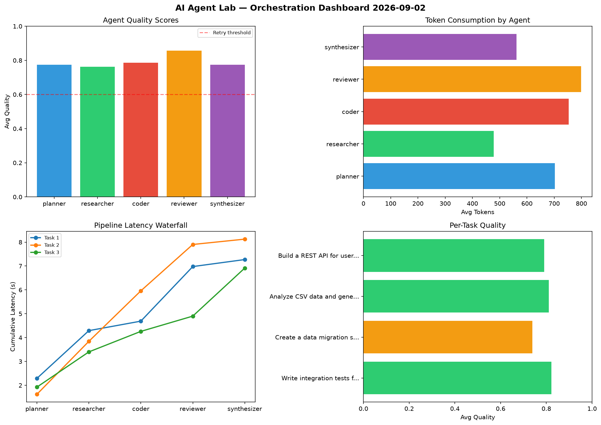

# AI Agent Lab — Orchestration Report 2026-09-02

**Run ID:** `f3b031b7f6` | **Tasks:** 4 | **Avg Quality:** 0.791

## Aggregate Metrics

| Metric | Value |
|--------|-------|
| avg_latency | 7.257 |
| total_tokens | 13175 |
| avg_quality | 0.791 |

## Delta vs Yesterday

| Metric | Today | Yesterday | Change |
|--------|-------|-----------|--------|
| avg_latency | 7.257 | 7.649 | 📉 -5.1% |
| total_tokens | 13175 | 14645 | 📉 -10.0% |
| avg_quality | 0.791 | 0.731 | 📈 8.2% |

## Pipeline Results

### Write integration tests for payment processing module
| Agent | Quality | Latency | Tokens | Status |
|-------|---------|---------|--------|--------|
| planner | 0.906 | 2.29s | 1028 | success |
| researcher | 0.903 | 2.001s | 477 | success |
| coder | 0.686 | 0.398s | 644 | success |
| reviewer | 0.793 | 2.288s | 858 | success |
| synthesizer | 0.823 | 0.294s | 316 | success |

### Create a data migration script for schema v2
| Agent | Quality | Latency | Tokens | Status |
|-------|---------|---------|--------|--------|
| planner | 0.509 | 1.623s | 417 | needs_retry |
| researcher | 0.743 | 2.22s | 236 | success |
| coder | 0.922 | 2.116s | 1016 | success |
| reviewer | 0.786 | 1.944s | 815 | success |
| synthesizer | 0.735 | 0.224s | 567 | success |

### Analyze CSV data and generate statistical summary
| Agent | Quality | Latency | Tokens | Status |
|-------|---------|---------|--------|--------|
| planner | 0.793 | 1.924s | 546 | success |
| researcher | 0.894 | 1.476s | 531 | success |
| coder | 0.696 | 0.86s | 589 | success |
| reviewer | 0.94 | 0.64s | 1014 | success |
| synthesizer | 0.732 | 2.014s | 487 | success |

### Build a REST API for user authentication
| Agent | Quality | Latency | Tokens | Status |
|-------|---------|---------|--------|--------|
| planner | 0.891 | 1.299s | 817 | success |
| researcher | 0.508 | 2.342s | 668 | needs_retry |
| coder | 0.84 | 1.006s | 763 | success |
| reviewer | 0.908 | 1.555s | 509 | success |
| synthesizer | 0.808 | 0.514s | 877 | success |
