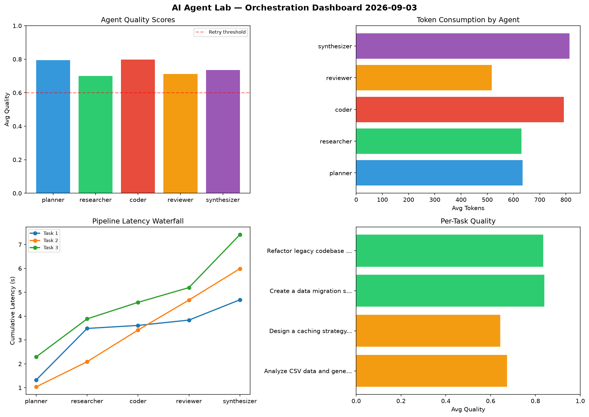

# AI Agent Lab — Orchestration Report 2026-09-03

**Run ID:** `094ad2c73b` | **Tasks:** 4 | **Avg Quality:** 0.748

## Aggregate Metrics

| Metric | Value |
|--------|-------|
| avg_latency | 6.351 |
| total_tokens | 13554 |
| avg_quality | 0.748 |

## Delta vs Yesterday

| Metric | Today | Yesterday | Change |
|--------|-------|-----------|--------|
| avg_latency | 6.351 | 5.627 | 📈 12.9% |
| total_tokens | 13554 | 14903 | 📉 -9.1% |
| avg_quality | 0.748 | 0.766 | 📉 -2.3% |

## Pipeline Results

### Analyze CSV data and generate statistical summary
| Agent | Quality | Latency | Tokens | Status |
|-------|---------|---------|--------|--------|
| planner | 0.769 | 1.325s | 354 | success |
| researcher | 0.626 | 2.159s | 746 | success |
| coder | 0.873 | 0.127s | 996 | success |
| reviewer | 0.587 | 0.224s | 601 | needs_retry |
| synthesizer | 0.511 | 0.85s | 835 | needs_retry |

### Design a caching strategy for high-traffic endpoints
| Agent | Quality | Latency | Tokens | Status |
|-------|---------|---------|--------|--------|
| planner | 0.717 | 1.035s | 702 | success |
| researcher | 0.503 | 1.054s | 327 | needs_retry |
| coder | 0.611 | 1.328s | 872 | success |
| reviewer | 0.658 | 1.259s | 529 | success |
| synthesizer | 0.728 | 1.313s | 1051 | success |

### Create a data migration script for schema v2
| Agent | Quality | Latency | Tokens | Status |
|-------|---------|---------|--------|--------|
| planner | 0.804 | 2.291s | 978 | success |
| researcher | 0.902 | 1.594s | 243 | success |
| coder | 0.828 | 0.693s | 657 | success |
| reviewer | 0.936 | 0.619s | 511 | success |
| synthesizer | 0.731 | 2.22s | 521 | success |

### Refactor legacy codebase to use dependency injection
| Agent | Quality | Latency | Tokens | Status |
|-------|---------|---------|--------|--------|
| planner | 0.888 | 2.049s | 504 | success |
| researcher | 0.773 | 1.171s | 1206 | success |
| coder | 0.879 | 0.929s | 642 | success |
| reviewer | 0.665 | 2.005s | 430 | success |
| synthesizer | 0.972 | 1.16s | 849 | success |
