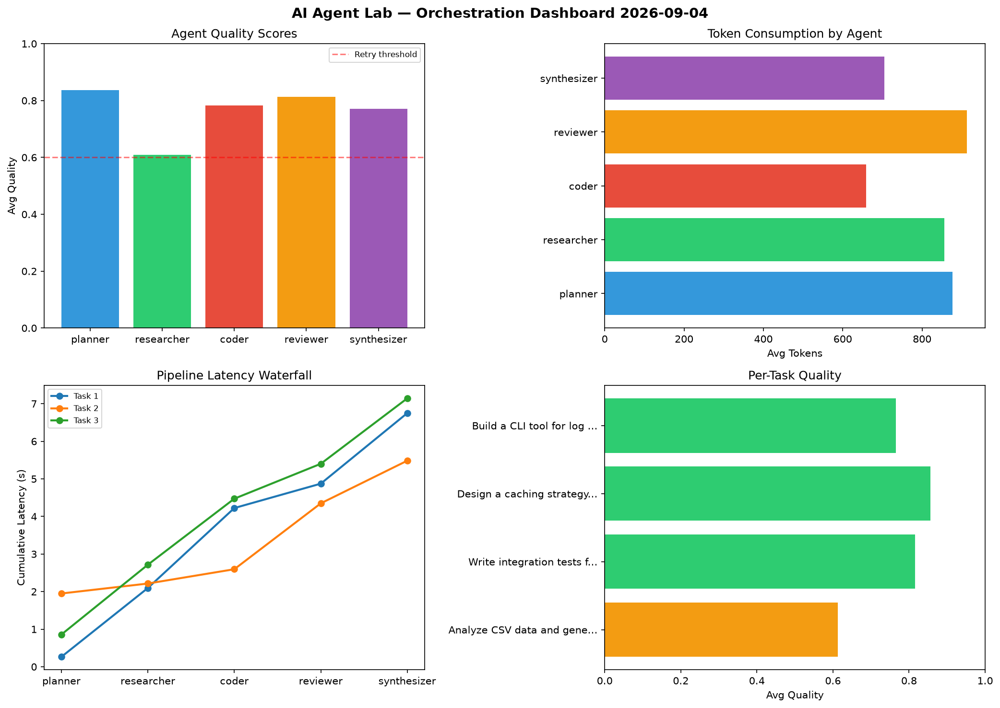

# AI Agent Lab — Orchestration Report 2026-09-04

**Run ID:** `54d6670964` | **Tasks:** 4 | **Avg Quality:** 0.763

## Aggregate Metrics

| Metric | Value |
|--------|-------|
| avg_latency | 6.861 |
| total_tokens | 16039 |
| avg_quality | 0.763 |

## Delta vs Yesterday

| Metric | Today | Yesterday | Change |
|--------|-------|-----------|--------|
| avg_latency | 6.861 | 6.988 | 📉 -1.8% |
| total_tokens | 16039 | 14068 | 📈 14.0% |
| avg_quality | 0.763 | 0.748 | 📈 2.0% |

## Pipeline Results

### Analyze CSV data and generate statistical summary
| Agent | Quality | Latency | Tokens | Status |
|-------|---------|---------|--------|--------|
| planner | 0.584 | 0.264s | 960 | needs_retry |
| researcher | 0.591 | 1.832s | 1056 | needs_retry |
| coder | 0.797 | 2.128s | 920 | success |
| reviewer | 0.506 | 0.649s | 922 | needs_retry |
| synthesizer | 0.589 | 1.877s | 665 | needs_retry |

### Write integration tests for payment processing module
| Agent | Quality | Latency | Tokens | Status |
|-------|---------|---------|--------|--------|
| planner | 0.851 | 1.95s | 861 | success |
| researcher | 0.507 | 0.265s | 994 | needs_retry |
| coder | 0.846 | 0.381s | 269 | success |
| reviewer | 0.96 | 1.753s | 642 | success |
| synthesizer | 0.914 | 1.135s | 900 | success |

### Design a caching strategy for high-traffic endpoints
| Agent | Quality | Latency | Tokens | Status |
|-------|---------|---------|--------|--------|
| planner | 0.988 | 0.858s | 1007 | success |
| researcher | 0.802 | 1.858s | 890 | success |
| coder | 0.784 | 1.757s | 864 | success |
| reviewer | 0.928 | 0.929s | 993 | success |
| synthesizer | 0.777 | 1.741s | 580 | success |

### Build a CLI tool for log analysis
| Agent | Quality | Latency | Tokens | Status |
|-------|---------|---------|--------|--------|
| planner | 0.927 | 1.529s | 678 | success |
| researcher | 0.536 | 2.037s | 485 | needs_retry |
| coder | 0.704 | 0.964s | 581 | success |
| reviewer | 0.859 | 2.482s | 1096 | success |
| synthesizer | 0.805 | 1.054s | 676 | success |
