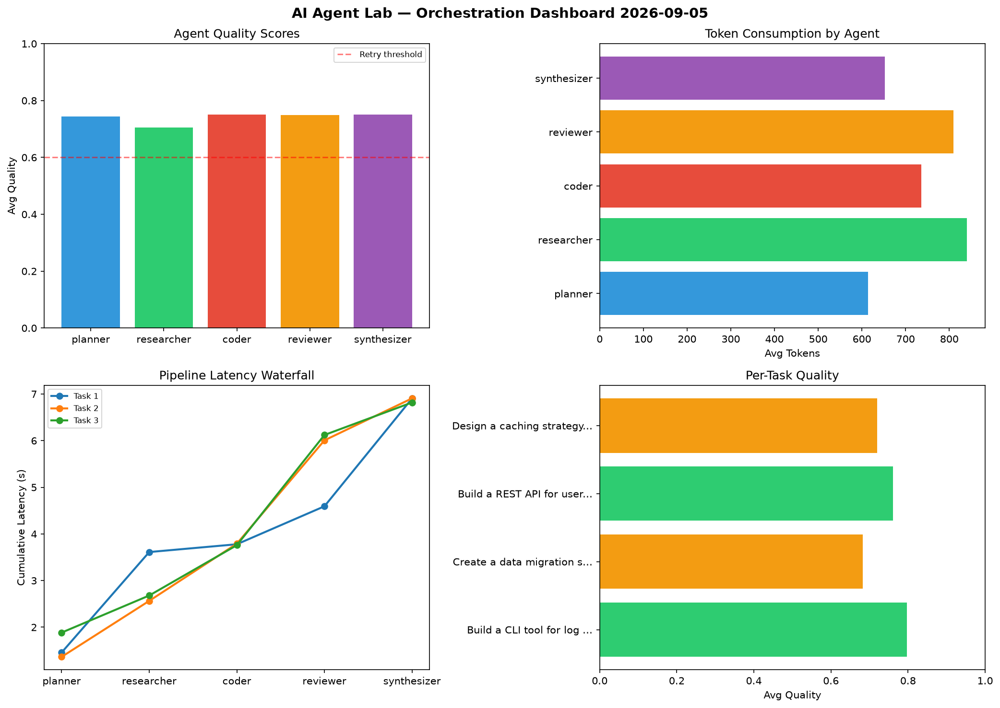

# AI Agent Lab — Orchestration Report 2026-09-05

**Run ID:** `2725e25b81` | **Tasks:** 4 | **Avg Quality:** 0.74

## Aggregate Metrics

| Metric | Value |
|--------|-------|
| avg_latency | 7.156 |
| total_tokens | 14608 |
| avg_quality | 0.74 |

## Delta vs Yesterday

| Metric | Today | Yesterday | Change |
|--------|-------|-----------|--------|
| avg_latency | 7.156 | 6.861 | 📈 4.3% |
| total_tokens | 14608 | 16039 | 📉 -8.9% |
| avg_quality | 0.74 | 0.763 | 📉 -3.0% |

## Pipeline Results

### Build a CLI tool for log analysis
| Agent | Quality | Latency | Tokens | Status |
|-------|---------|---------|--------|--------|
| planner | 0.741 | 1.458s | 702 | success |
| researcher | 0.716 | 2.154s | 991 | success |
| coder | 0.85 | 0.167s | 1143 | success |
| reviewer | 0.783 | 0.814s | 451 | success |
| synthesizer | 0.893 | 2.312s | 761 | success |

### Create a data migration script for schema v2
| Agent | Quality | Latency | Tokens | Status |
|-------|---------|---------|--------|--------|
| planner | 0.659 | 1.365s | 727 | success |
| researcher | 0.987 | 1.2s | 897 | success |
| coder | 0.504 | 1.226s | 470 | needs_retry |
| reviewer | 0.53 | 2.216s | 501 | needs_retry |
| synthesizer | 0.73 | 0.9s | 684 | success |

### Build a REST API for user authentication
| Agent | Quality | Latency | Tokens | Status |
|-------|---------|---------|--------|--------|
| planner | 0.677 | 1.885s | 437 | success |
| researcher | 0.578 | 0.795s | 413 | needs_retry |
| coder | 0.998 | 1.079s | 1035 | success |
| reviewer | 0.683 | 2.363s | 1234 | success |
| synthesizer | 0.867 | 0.697s | 320 | success |

### Design a caching strategy for high-traffic endpoints
| Agent | Quality | Latency | Tokens | Status |
|-------|---------|---------|--------|--------|
| planner | 0.898 | 1.825s | 590 | success |
| researcher | 0.541 | 2.178s | 1059 | needs_retry |
| coder | 0.652 | 1.834s | 296 | success |
| reviewer | 1.0 | 1.3s | 1054 | success |
| synthesizer | 0.51 | 0.857s | 843 | needs_retry |
