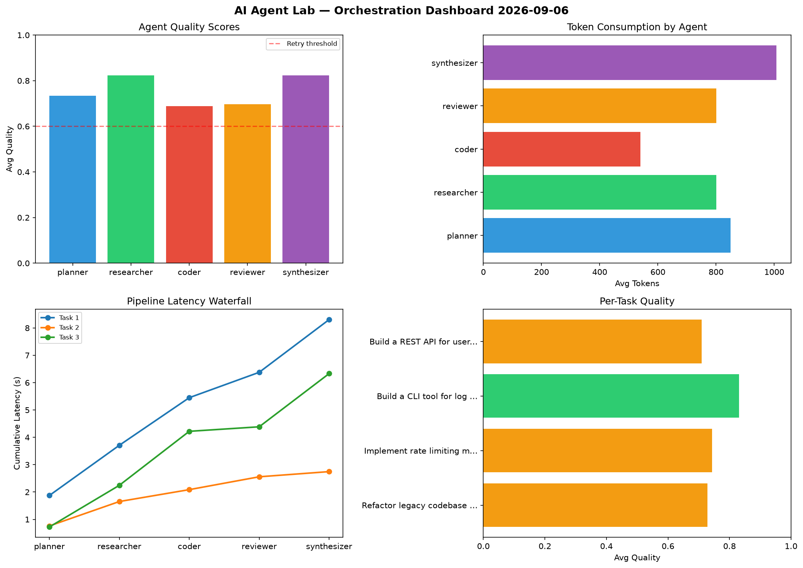

# AI Agent Lab — Orchestration Report 2026-09-06

**Run ID:** `ea5c207979` | **Tasks:** 4 | **Avg Quality:** 0.753

## Aggregate Metrics

| Metric | Value |
|--------|-------|
| avg_latency | 5.638 |
| total_tokens | 15999 |
| avg_quality | 0.753 |

## Delta vs Yesterday

| Metric | Today | Yesterday | Change |
|--------|-------|-----------|--------|
| avg_latency | 5.638 | 5.559 | 📈 1.4% |
| total_tokens | 15999 | 14102 | 📈 13.5% |
| avg_quality | 0.753 | 0.688 | 📈 9.4% |

## Pipeline Results

### Refactor legacy codebase to use dependency injection
| Agent | Quality | Latency | Tokens | Status |
|-------|---------|---------|--------|--------|
| planner | 0.903 | 1.874s | 1079 | success |
| researcher | 0.896 | 1.835s | 945 | success |
| coder | 0.506 | 1.741s | 789 | needs_retry |
| reviewer | 0.538 | 0.928s | 886 | needs_retry |
| synthesizer | 0.797 | 1.928s | 1131 | success |

### Implement rate limiting middleware
| Agent | Quality | Latency | Tokens | Status |
|-------|---------|---------|--------|--------|
| planner | 0.866 | 0.76s | 626 | success |
| researcher | 0.915 | 0.892s | 447 | success |
| coder | 0.535 | 0.435s | 312 | needs_retry |
| reviewer | 0.554 | 0.47s | 674 | needs_retry |
| synthesizer | 0.845 | 0.189s | 863 | success |

### Build a CLI tool for log analysis
| Agent | Quality | Latency | Tokens | Status |
|-------|---------|---------|--------|--------|
| planner | 0.542 | 0.722s | 835 | needs_retry |
| researcher | 0.955 | 1.523s | 913 | success |
| coder | 0.955 | 1.975s | 754 | success |
| reviewer | 0.951 | 0.165s | 791 | success |
| synthesizer | 0.754 | 1.946s | 755 | success |

### Build a REST API for user authentication
| Agent | Quality | Latency | Tokens | Status |
|-------|---------|---------|--------|--------|
| planner | 0.622 | 0.82s | 858 | success |
| researcher | 0.524 | 1.594s | 898 | needs_retry |
| coder | 0.756 | 1.458s | 307 | success |
| reviewer | 0.745 | 0.887s | 855 | success |
| synthesizer | 0.898 | 0.409s | 1281 | success |
