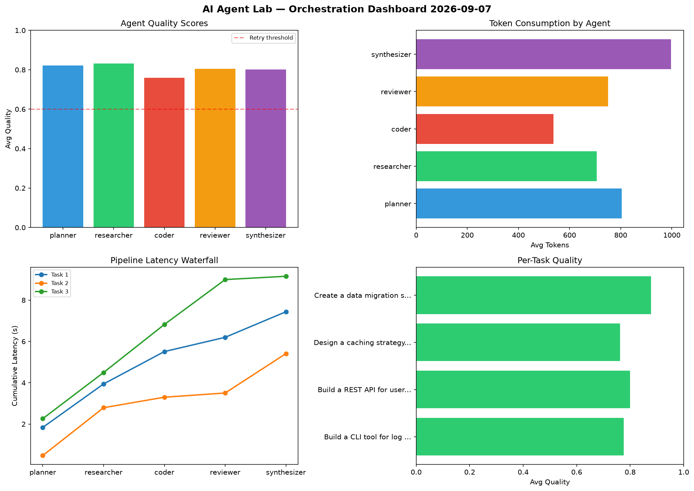

# AI Agent Lab — Orchestration Report 2026-09-07

**Run ID:** `196eacc424` | **Tasks:** 4 | **Avg Quality:** 0.804

## Aggregate Metrics

| Metric | Value |
|--------|-------|
| avg_latency | 6.68 |
| total_tokens | 15173 |
| avg_quality | 0.804 |

## Delta vs Yesterday

| Metric | Today | Yesterday | Change |
|--------|-------|-----------|--------|
| avg_latency | 6.68 | 6.896 | 📉 -3.1% |
| total_tokens | 15173 | 14326 | 📈 5.9% |
| avg_quality | 0.804 | 0.794 | 📈 1.3% |

## Pipeline Results

### Build a CLI tool for log analysis
| Agent | Quality | Latency | Tokens | Status |
|-------|---------|---------|--------|--------|
| planner | 0.564 | 1.839s | 687 | needs_retry |
| researcher | 0.831 | 2.104s | 315 | success |
| coder | 0.745 | 1.567s | 512 | success |
| reviewer | 0.904 | 0.69s | 912 | success |
| synthesizer | 0.836 | 1.238s | 678 | success |

### Build a REST API for user authentication
| Agent | Quality | Latency | Tokens | Status |
|-------|---------|---------|--------|--------|
| planner | 0.989 | 0.478s | 611 | success |
| researcher | 0.898 | 2.314s | 645 | success |
| coder | 0.698 | 0.509s | 368 | success |
| reviewer | 0.802 | 0.203s | 782 | success |
| synthesizer | 0.608 | 1.909s | 1147 | success |

### Design a caching strategy for high-traffic endpoints
| Agent | Quality | Latency | Tokens | Status |
|-------|---------|---------|--------|--------|
| planner | 0.755 | 2.262s | 1036 | success |
| researcher | 0.702 | 2.234s | 1039 | success |
| coder | 0.856 | 2.325s | 319 | success |
| reviewer | 0.643 | 2.174s | 526 | success |
| synthesizer | 0.852 | 0.16s | 1021 | success |

### Create a data migration script for schema v2
| Agent | Quality | Latency | Tokens | Status |
|-------|---------|---------|--------|--------|
| planner | 0.978 | 0.163s | 882 | success |
| researcher | 0.894 | 1.635s | 825 | success |
| coder | 0.74 | 0.201s | 947 | success |
| reviewer | 0.867 | 1.198s | 781 | success |
| synthesizer | 0.911 | 1.518s | 1140 | success |
