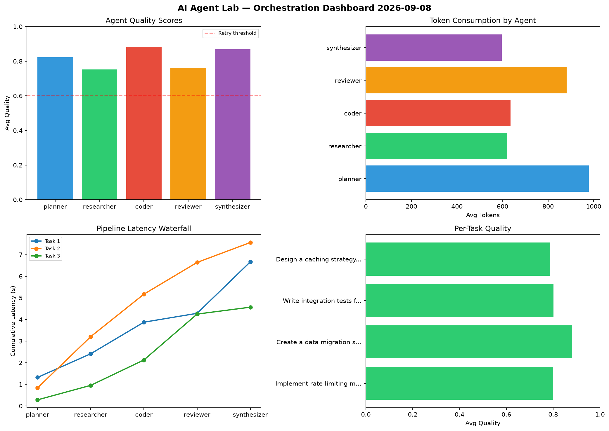

# AI Agent Lab — Orchestration Report 2026-09-08

**Run ID:** `1b3e44b6fa` | **Tasks:** 4 | **Avg Quality:** 0.817

## Aggregate Metrics

| Metric | Value |
|--------|-------|
| avg_latency | 7.096 |
| total_tokens | 14854 |
| avg_quality | 0.817 |

## Delta vs Yesterday

| Metric | Today | Yesterday | Change |
|--------|-------|-----------|--------|
| avg_latency | 7.096 | 6.623 | 📈 7.1% |
| total_tokens | 14854 | 14017 | 📈 6.0% |
| avg_quality | 0.817 | 0.775 | 📈 5.4% |

## Pipeline Results

### Implement rate limiting middleware
| Agent | Quality | Latency | Tokens | Status |
|-------|---------|---------|--------|--------|
| planner | 0.818 | 1.319s | 1022 | success |
| researcher | 0.734 | 1.094s | 808 | success |
| coder | 0.814 | 1.461s | 738 | success |
| reviewer | 0.641 | 0.41s | 679 | success |
| synthesizer | 0.993 | 2.382s | 516 | success |

### Create a data migration script for schema v2
| Agent | Quality | Latency | Tokens | Status |
|-------|---------|---------|--------|--------|
| planner | 0.914 | 0.833s | 889 | success |
| researcher | 0.804 | 2.372s | 321 | success |
| coder | 0.938 | 1.965s | 737 | success |
| reviewer | 0.78 | 1.469s | 1014 | success |
| synthesizer | 0.975 | 0.921s | 646 | success |

### Write integration tests for payment processing module
| Agent | Quality | Latency | Tokens | Status |
|-------|---------|---------|--------|--------|
| planner | 0.69 | 0.281s | 1100 | success |
| researcher | 0.775 | 0.671s | 511 | success |
| coder | 0.919 | 1.175s | 369 | success |
| reviewer | 0.672 | 2.122s | 752 | success |
| synthesizer | 0.949 | 0.319s | 432 | success |

### Design a caching strategy for high-traffic endpoints
| Agent | Quality | Latency | Tokens | Status |
|-------|---------|---------|--------|--------|
| planner | 0.871 | 1.754s | 904 | success |
| researcher | 0.695 | 2.143s | 846 | success |
| coder | 0.861 | 1.629s | 698 | success |
| reviewer | 0.948 | 2.327s | 1081 | success |
| synthesizer | 0.557 | 1.739s | 791 | needs_retry |
