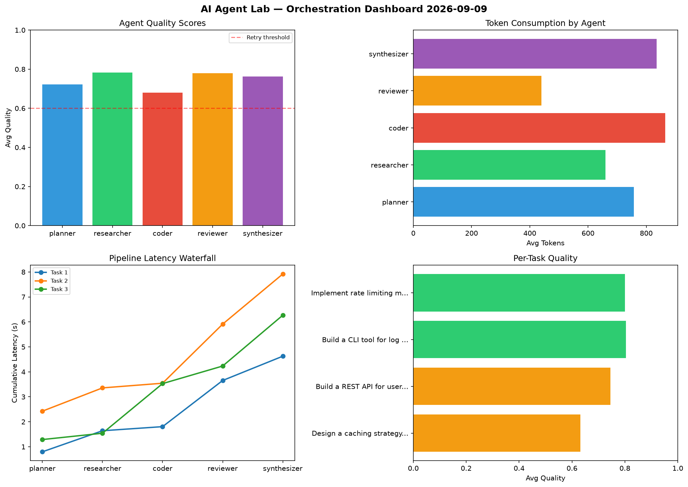

# AI Agent Lab — Orchestration Report 2026-09-09

**Run ID:** `5098a0ce18` | **Tasks:** 4 | **Avg Quality:** 0.745

## Aggregate Metrics

| Metric | Value |
|--------|-------|
| avg_latency | 6.652 |
| total_tokens | 14230 |
| avg_quality | 0.745 |

## Delta vs Yesterday

| Metric | Today | Yesterday | Change |
|--------|-------|-----------|--------|
| avg_latency | 6.652 | 7.096 | 📉 -6.3% |
| total_tokens | 14230 | 14854 | 📉 -4.2% |
| avg_quality | 0.745 | 0.817 | 📉 -8.8% |

## Pipeline Results

### Design a caching strategy for high-traffic endpoints
| Agent | Quality | Latency | Tokens | Status |
|-------|---------|---------|--------|--------|
| planner | 0.598 | 0.797s | 960 | needs_retry |
| researcher | 0.516 | 0.844s | 447 | needs_retry |
| coder | 0.776 | 0.164s | 1109 | success |
| reviewer | 0.758 | 1.849s | 312 | success |
| synthesizer | 0.513 | 0.972s | 889 | needs_retry |

### Build a REST API for user authentication
| Agent | Quality | Latency | Tokens | Status |
|-------|---------|---------|--------|--------|
| planner | 0.783 | 2.425s | 336 | success |
| researcher | 0.701 | 0.932s | 694 | success |
| coder | 0.525 | 0.187s | 447 | needs_retry |
| reviewer | 0.761 | 2.368s | 453 | success |
| synthesizer | 0.953 | 2.006s | 783 | success |

### Build a CLI tool for log analysis
| Agent | Quality | Latency | Tokens | Status |
|-------|---------|---------|--------|--------|
| planner | 0.877 | 1.288s | 848 | success |
| researcher | 0.942 | 0.253s | 597 | success |
| coder | 0.677 | 1.988s | 1220 | success |
| reviewer | 0.709 | 0.704s | 252 | success |
| synthesizer | 0.816 | 2.034s | 711 | success |

### Implement rate limiting middleware
| Agent | Quality | Latency | Tokens | Status |
|-------|---------|---------|--------|--------|
| planner | 0.633 | 1.068s | 886 | success |
| researcher | 0.972 | 2.436s | 901 | success |
| coder | 0.739 | 1.715s | 684 | success |
| reviewer | 0.888 | 0.128s | 743 | success |
| synthesizer | 0.766 | 2.451s | 958 | success |
