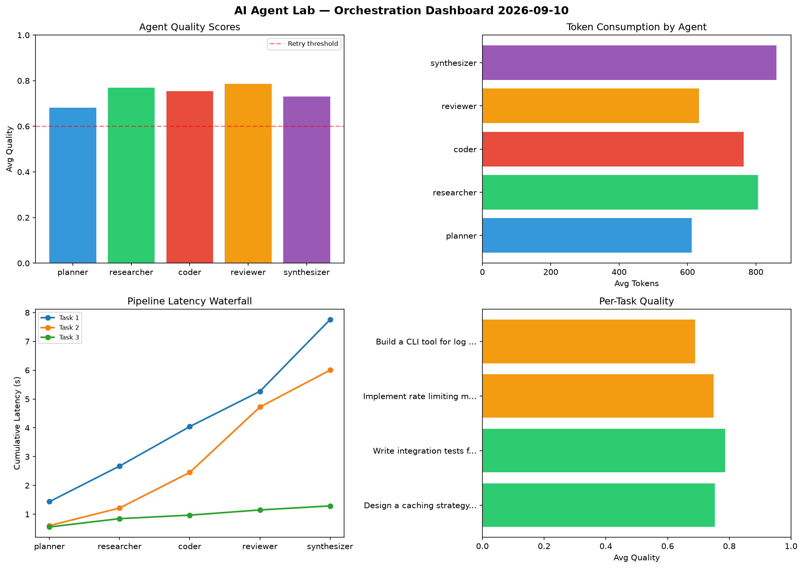

# AI Agent Lab — Orchestration Report 2026-09-10

**Run ID:** `5f5d5090de` | **Tasks:** 4 | **Avg Quality:** 0.745

## Aggregate Metrics

| Metric | Value |
|--------|-------|
| avg_latency | 5.598 |
| total_tokens | 14704 |
| avg_quality | 0.745 |

## Delta vs Yesterday

| Metric | Today | Yesterday | Change |
|--------|-------|-----------|--------|
| avg_latency | 5.598 | 6.997 | 📉 -20.0% |
| total_tokens | 14704 | 14180 | 📈 3.7% |
| avg_quality | 0.745 | 0.741 | 📈 0.5% |

## Pipeline Results

### Design a caching strategy for high-traffic endpoints
| Agent | Quality | Latency | Tokens | Status |
|-------|---------|---------|--------|--------|
| planner | 0.943 | 1.437s | 306 | success |
| researcher | 0.708 | 1.236s | 1009 | success |
| coder | 0.573 | 1.37s | 870 | needs_retry |
| reviewer | 0.616 | 1.223s | 203 | success |
| synthesizer | 0.923 | 2.492s | 797 | success |

### Write integration tests for payment processing module
| Agent | Quality | Latency | Tokens | Status |
|-------|---------|---------|--------|--------|
| planner | 0.645 | 0.605s | 972 | success |
| researcher | 0.826 | 0.611s | 928 | success |
| coder | 0.761 | 1.237s | 475 | success |
| reviewer | 0.991 | 2.27s | 890 | success |
| synthesizer | 0.711 | 1.28s | 608 | success |

### Implement rate limiting middleware
| Agent | Quality | Latency | Tokens | Status |
|-------|---------|---------|--------|--------|
| planner | 0.638 | 0.558s | 580 | success |
| researcher | 0.973 | 0.289s | 311 | success |
| coder | 0.891 | 0.121s | 745 | success |
| reviewer | 0.705 | 0.181s | 640 | success |
| synthesizer | 0.538 | 0.14s | 995 | needs_retry |

### Build a CLI tool for log analysis
| Agent | Quality | Latency | Tokens | Status |
|-------|---------|---------|--------|--------|
| planner | 0.501 | 0.704s | 590 | needs_retry |
| researcher | 0.567 | 2.129s | 976 | needs_retry |
| coder | 0.792 | 1.592s | 968 | success |
| reviewer | 0.834 | 1.332s | 801 | success |
| synthesizer | 0.75 | 1.586s | 1040 | success |
