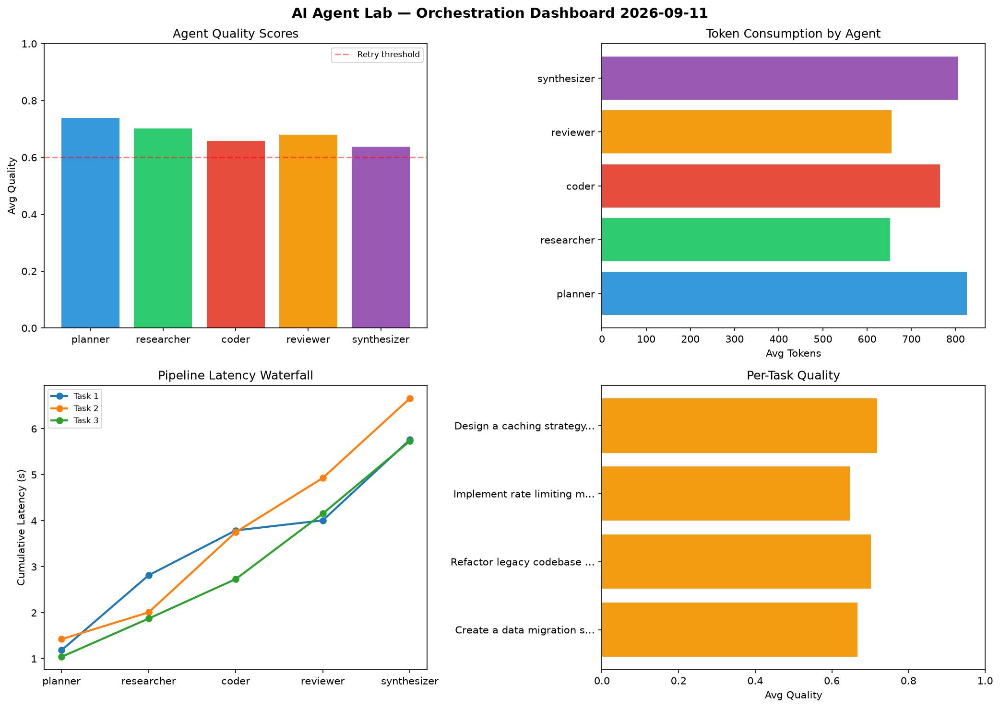

# AI Agent Lab — Orchestration Report 2026-09-11

**Run ID:** `5cad49d9c4` | **Tasks:** 4 | **Avg Quality:** 0.683

## Aggregate Metrics

| Metric | Value |
|--------|-------|
| avg_latency | 7.249 |
| total_tokens | 14820 |
| avg_quality | 0.683 |

## Delta vs Yesterday

| Metric | Today | Yesterday | Change |
|--------|-------|-----------|--------|
| avg_latency | 7.249 | 5.598 | 📈 29.5% |
| total_tokens | 14820 | 14704 | 📈 0.8% |
| avg_quality | 0.683 | 0.745 | 📉 -8.3% |

## Pipeline Results

### Create a data migration script for schema v2
| Agent | Quality | Latency | Tokens | Status |
|-------|---------|---------|--------|--------|
| planner | 0.765 | 1.185s | 1217 | success |
| researcher | 0.541 | 1.629s | 522 | needs_retry |
| coder | 0.616 | 0.976s | 949 | success |
| reviewer | 0.726 | 0.218s | 602 | success |
| synthesizer | 0.686 | 1.755s | 1097 | success |

### Refactor legacy codebase to use dependency injection
| Agent | Quality | Latency | Tokens | Status |
|-------|---------|---------|--------|--------|
| planner | 0.801 | 1.425s | 633 | success |
| researcher | 0.832 | 0.583s | 480 | success |
| coder | 0.68 | 1.744s | 578 | success |
| reviewer | 0.533 | 1.178s | 780 | needs_retry |
| synthesizer | 0.664 | 1.731s | 602 | success |

### Implement rate limiting middleware
| Agent | Quality | Latency | Tokens | Status |
|-------|---------|---------|--------|--------|
| planner | 0.755 | 1.041s | 1077 | success |
| researcher | 0.527 | 0.832s | 1011 | needs_retry |
| coder | 0.595 | 0.858s | 489 | needs_retry |
| reviewer | 0.716 | 1.424s | 911 | success |
| synthesizer | 0.641 | 1.577s | 1095 | success |

### Design a caching strategy for high-traffic endpoints
| Agent | Quality | Latency | Tokens | Status |
|-------|---------|---------|--------|--------|
| planner | 0.633 | 1.509s | 376 | success |
| researcher | 0.908 | 2.452s | 597 | success |
| coder | 0.744 | 2.315s | 1046 | success |
| reviewer | 0.742 | 2.49s | 330 | success |
| synthesizer | 0.562 | 2.075s | 428 | needs_retry |
