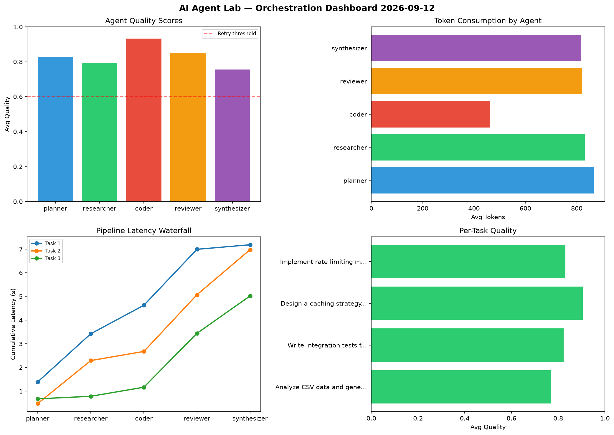

# AI Agent Lab — Orchestration Report 2026-09-12

**Run ID:** `3e90922c9e` | **Tasks:** 4 | **Avg Quality:** 0.833

## Aggregate Metrics

| Metric | Value |
|--------|-------|
| avg_latency | 6.408 |
| total_tokens | 15195 |
| avg_quality | 0.833 |

## Delta vs Yesterday

| Metric | Today | Yesterday | Change |
|--------|-------|-----------|--------|
| avg_latency | 6.408 | 5.867 | 📈 9.2% |
| total_tokens | 15195 | 12585 | 📈 20.7% |
| avg_quality | 0.833 | 0.798 | 📈 4.4% |

## Pipeline Results

### Analyze CSV data and generate statistical summary
| Agent | Quality | Latency | Tokens | Status |
|-------|---------|---------|--------|--------|
| planner | 0.784 | 1.393s | 678 | success |
| researcher | 0.824 | 2.032s | 645 | success |
| coder | 0.967 | 1.202s | 489 | success |
| reviewer | 0.771 | 2.361s | 1108 | success |
| synthesizer | 0.508 | 0.192s | 899 | needs_retry |

### Write integration tests for payment processing module
| Agent | Quality | Latency | Tokens | Status |
|-------|---------|---------|--------|--------|
| planner | 0.926 | 0.479s | 918 | success |
| researcher | 0.545 | 1.814s | 831 | needs_retry |
| coder | 0.942 | 0.386s | 681 | success |
| reviewer | 0.868 | 2.392s | 803 | success |
| synthesizer | 0.837 | 1.901s | 677 | success |

### Design a caching strategy for high-traffic endpoints
| Agent | Quality | Latency | Tokens | Status |
|-------|---------|---------|--------|--------|
| planner | 0.994 | 0.679s | 648 | success |
| researcher | 0.9 | 0.107s | 1031 | success |
| coder | 0.866 | 0.383s | 166 | success |
| reviewer | 0.778 | 2.275s | 812 | success |
| synthesizer | 0.992 | 1.574s | 593 | success |

### Implement rate limiting middleware
| Agent | Quality | Latency | Tokens | Status |
|-------|---------|---------|--------|--------|
| planner | 0.612 | 0.132s | 1221 | success |
| researcher | 0.912 | 2.258s | 817 | success |
| coder | 0.959 | 0.637s | 516 | success |
| reviewer | 0.986 | 1.493s | 563 | success |
| synthesizer | 0.688 | 1.943s | 1099 | success |
