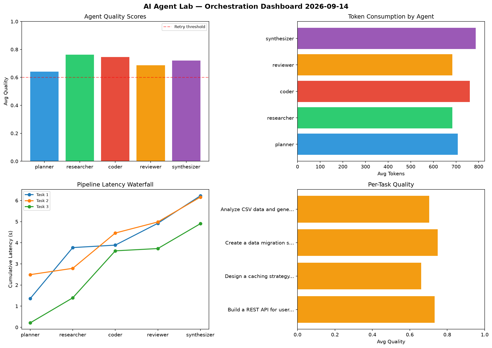

# AI Agent Lab — Orchestration Report 2026-09-14

**Run ID:** `172f570394` | **Tasks:** 4 | **Avg Quality:** 0.711

## Aggregate Metrics

| Metric | Value |
|--------|-------|
| avg_latency | 5.987 |
| total_tokens | 14493 |
| avg_quality | 0.711 |

## Delta vs Yesterday

| Metric | Today | Yesterday | Change |
|--------|-------|-----------|--------|
| avg_latency | 5.987 | 5.294 | 📈 13.1% |
| total_tokens | 14493 | 13412 | 📈 8.1% |
| avg_quality | 0.711 | 0.761 | 📉 -6.6% |

## Pipeline Results

### Build a REST API for user authentication
| Agent | Quality | Latency | Tokens | Status |
|-------|---------|---------|--------|--------|
| planner | 0.617 | 1.36s | 1004 | success |
| researcher | 0.857 | 2.411s | 898 | success |
| coder | 0.844 | 0.116s | 620 | success |
| reviewer | 0.691 | 1.033s | 649 | success |
| synthesizer | 0.65 | 1.3s | 1139 | success |

### Design a caching strategy for high-traffic endpoints
| Agent | Quality | Latency | Tokens | Status |
|-------|---------|---------|--------|--------|
| planner | 0.728 | 2.491s | 910 | success |
| researcher | 0.59 | 0.298s | 909 | needs_retry |
| coder | 0.573 | 1.67s | 624 | needs_retry |
| reviewer | 0.796 | 0.524s | 283 | success |
| synthesizer | 0.62 | 1.176s | 514 | success |

### Create a data migration script for schema v2
| Agent | Quality | Latency | Tokens | Status |
|-------|---------|---------|--------|--------|
| planner | 0.633 | 0.21s | 311 | success |
| researcher | 0.809 | 1.184s | 304 | success |
| coder | 0.729 | 2.223s | 934 | success |
| reviewer | 0.647 | 0.108s | 849 | success |
| synthesizer | 0.928 | 1.176s | 1091 | success |

### Analyze CSV data and generate statistical summary
| Agent | Quality | Latency | Tokens | Status |
|-------|---------|---------|--------|--------|
| planner | 0.588 | 2.015s | 606 | needs_retry |
| researcher | 0.792 | 2.16s | 626 | success |
| coder | 0.838 | 0.387s | 864 | success |
| reviewer | 0.612 | 0.121s | 953 | success |
| synthesizer | 0.687 | 1.986s | 405 | success |
