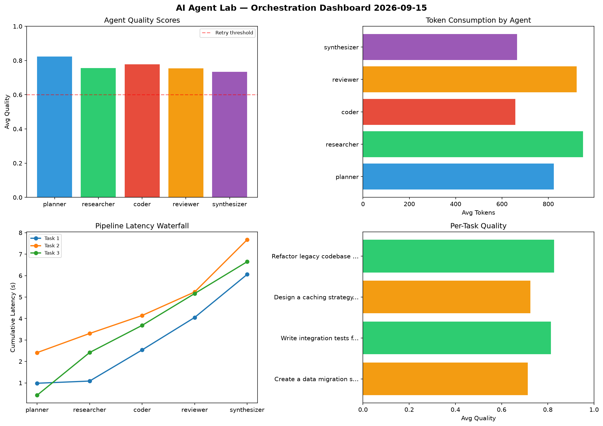

# AI Agent Lab — Orchestration Report 2026-09-15

**Run ID:** `2b9cc7ba30` | **Tasks:** 4 | **Avg Quality:** 0.769

## Aggregate Metrics

| Metric | Value |
|--------|-------|
| avg_latency | 6.484 |
| total_tokens | 16077 |
| avg_quality | 0.769 |

## Delta vs Yesterday

| Metric | Today | Yesterday | Change |
|--------|-------|-----------|--------|
| avg_latency | 6.484 | 8.17 | 📉 -20.6% |
| total_tokens | 16077 | 14921 | 📈 7.7% |
| avg_quality | 0.769 | 0.767 | 📈 0.3% |

## Pipeline Results

### Create a data migration script for schema v2
| Agent | Quality | Latency | Tokens | Status |
|-------|---------|---------|--------|--------|
| planner | 0.98 | 0.984s | 818 | success |
| researcher | 0.663 | 0.102s | 803 | success |
| coder | 0.598 | 1.451s | 537 | needs_retry |
| reviewer | 0.755 | 1.513s | 758 | success |
| synthesizer | 0.567 | 2.006s | 825 | needs_retry |

### Write integration tests for payment processing module
| Agent | Quality | Latency | Tokens | Status |
|-------|---------|---------|--------|--------|
| planner | 0.643 | 2.412s | 741 | success |
| researcher | 0.772 | 0.892s | 1111 | success |
| coder | 0.802 | 0.839s | 627 | success |
| reviewer | 0.909 | 1.095s | 1043 | success |
| synthesizer | 0.937 | 2.436s | 702 | success |

### Design a caching strategy for high-traffic endpoints
| Agent | Quality | Latency | Tokens | Status |
|-------|---------|---------|--------|--------|
| planner | 0.804 | 0.426s | 744 | success |
| researcher | 0.804 | 1.99s | 996 | success |
| coder | 0.793 | 1.266s | 608 | success |
| reviewer | 0.707 | 1.482s | 807 | success |
| synthesizer | 0.511 | 1.484s | 448 | needs_retry |

### Refactor legacy codebase to use dependency injection
| Agent | Quality | Latency | Tokens | Status |
|-------|---------|---------|--------|--------|
| planner | 0.867 | 0.325s | 991 | success |
| researcher | 0.783 | 1.435s | 890 | success |
| coder | 0.917 | 1.184s | 857 | success |
| reviewer | 0.647 | 0.305s | 1084 | success |
| synthesizer | 0.921 | 2.307s | 687 | success |
