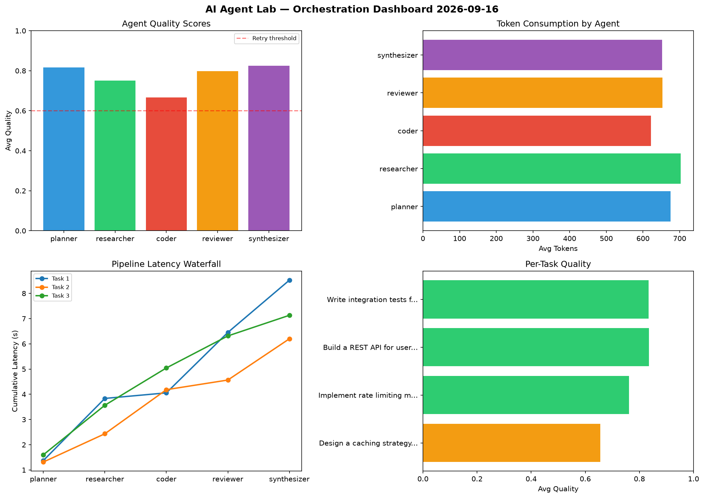

# AI Agent Lab — Orchestration Report 2026-09-16

**Run ID:** `49c8fab2b1` | **Tasks:** 4 | **Avg Quality:** 0.771

## Aggregate Metrics

| Metric | Value |
|--------|-------|
| avg_latency | 7.735 |
| total_tokens | 13220 |
| avg_quality | 0.771 |

## Delta vs Yesterday

| Metric | Today | Yesterday | Change |
|--------|-------|-----------|--------|
| avg_latency | 7.735 | 6.484 | 📈 19.3% |
| total_tokens | 13220 | 16077 | 📉 -17.8% |
| avg_quality | 0.771 | 0.769 | 📈 0.3% |

## Pipeline Results

### Design a caching strategy for high-traffic endpoints
| Agent | Quality | Latency | Tokens | Status |
|-------|---------|---------|--------|--------|
| planner | 0.517 | 1.375s | 954 | needs_retry |
| researcher | 0.937 | 2.461s | 347 | success |
| coder | 0.568 | 0.22s | 281 | needs_retry |
| reviewer | 0.525 | 2.396s | 407 | needs_retry |
| synthesizer | 0.734 | 2.07s | 542 | success |

### Implement rate limiting middleware
| Agent | Quality | Latency | Tokens | Status |
|-------|---------|---------|--------|--------|
| planner | 0.883 | 1.315s | 681 | success |
| researcher | 0.567 | 1.12s | 847 | needs_retry |
| coder | 0.581 | 1.747s | 674 | needs_retry |
| reviewer | 0.917 | 0.383s | 828 | success |
| synthesizer | 0.857 | 1.634s | 563 | success |

### Build a REST API for user authentication
| Agent | Quality | Latency | Tokens | Status |
|-------|---------|---------|--------|--------|
| planner | 0.942 | 1.602s | 531 | success |
| researcher | 0.728 | 1.963s | 784 | success |
| coder | 0.736 | 1.479s | 991 | success |
| reviewer | 0.946 | 1.269s | 621 | success |
| synthesizer | 0.822 | 0.818s | 824 | success |

### Write integration tests for payment processing module
| Agent | Quality | Latency | Tokens | Status |
|-------|---------|---------|--------|--------|
| planner | 0.923 | 1.793s | 535 | success |
| researcher | 0.774 | 2.438s | 833 | success |
| coder | 0.781 | 0.114s | 540 | success |
| reviewer | 0.804 | 2.408s | 756 | success |
| synthesizer | 0.887 | 2.334s | 681 | success |
