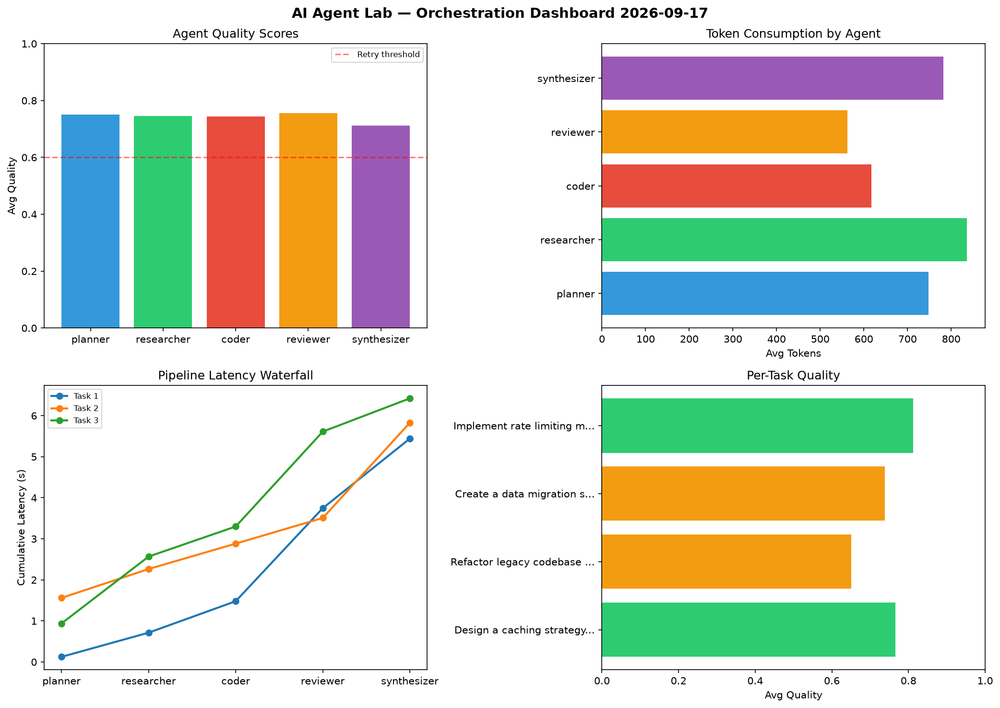

# AI Agent Lab — Orchestration Report 2026-09-17

**Run ID:** `af23b17aec` | **Tasks:** 4 | **Avg Quality:** 0.742

## Aggregate Metrics

| Metric | Value |
|--------|-------|
| avg_latency | 5.583 |
| total_tokens | 14182 |
| avg_quality | 0.742 |

## Delta vs Yesterday

| Metric | Today | Yesterday | Change |
|--------|-------|-----------|--------|
| avg_latency | 5.583 | 6.561 | 📉 -14.9% |
| total_tokens | 14182 | 14054 | 📈 0.9% |
| avg_quality | 0.742 | 0.842 | 📉 -11.9% |

## Pipeline Results

### Design a caching strategy for high-traffic endpoints
| Agent | Quality | Latency | Tokens | Status |
|-------|---------|---------|--------|--------|
| planner | 0.872 | 0.125s | 1001 | success |
| researcher | 0.857 | 0.589s | 972 | success |
| coder | 0.764 | 0.766s | 639 | success |
| reviewer | 0.577 | 2.267s | 344 | needs_retry |
| synthesizer | 0.761 | 1.695s | 767 | success |

### Refactor legacy codebase to use dependency injection
| Agent | Quality | Latency | Tokens | Status |
|-------|---------|---------|--------|--------|
| planner | 0.609 | 1.561s | 590 | success |
| researcher | 0.575 | 0.704s | 1145 | needs_retry |
| coder | 0.853 | 0.618s | 532 | success |
| reviewer | 0.641 | 0.626s | 618 | success |
| synthesizer | 0.573 | 2.319s | 715 | needs_retry |

### Create a data migration script for schema v2
| Agent | Quality | Latency | Tokens | Status |
|-------|---------|---------|--------|--------|
| planner | 0.599 | 0.939s | 525 | needs_retry |
| researcher | 0.893 | 1.629s | 596 | success |
| coder | 0.753 | 0.732s | 880 | success |
| reviewer | 0.893 | 2.312s | 725 | success |
| synthesizer | 0.55 | 0.81s | 739 | needs_retry |

### Implement rate limiting middleware
| Agent | Quality | Latency | Tokens | Status |
|-------|---------|---------|--------|--------|
| planner | 0.923 | 0.187s | 878 | success |
| researcher | 0.659 | 0.569s | 631 | success |
| coder | 0.606 | 1.279s | 416 | success |
| reviewer | 0.913 | 1.681s | 563 | success |
| synthesizer | 0.961 | 0.926s | 906 | success |
