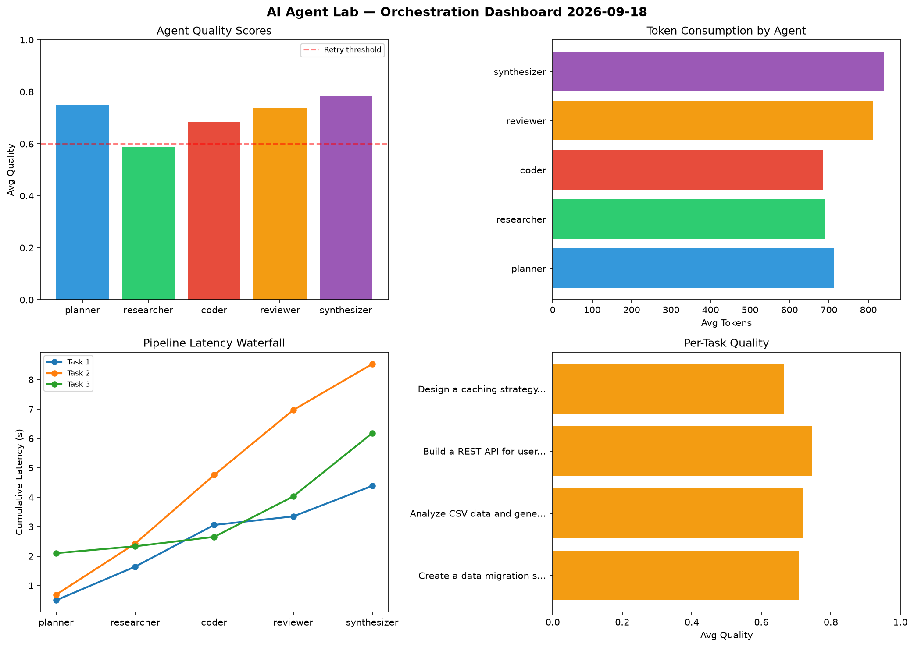

# AI Agent Lab — Orchestration Report 2026-09-18

**Run ID:** `defb1a9ae0` | **Tasks:** 4 | **Avg Quality:** 0.71

## Aggregate Metrics

| Metric | Value |
|--------|-------|
| avg_latency | 6.788 |
| total_tokens | 14947 |
| avg_quality | 0.71 |

## Delta vs Yesterday

| Metric | Today | Yesterday | Change |
|--------|-------|-----------|--------|
| avg_latency | 6.788 | 6.908 | 📉 -1.7% |
| total_tokens | 14947 | 15426 | 📉 -3.1% |
| avg_quality | 0.71 | 0.782 | 📉 -9.2% |

## Pipeline Results

### Create a data migration script for schema v2
| Agent | Quality | Latency | Tokens | Status |
|-------|---------|---------|--------|--------|
| planner | 0.774 | 0.502s | 631 | success |
| researcher | 0.555 | 1.142s | 572 | needs_retry |
| coder | 0.868 | 1.417s | 885 | success |
| reviewer | 0.731 | 0.29s | 976 | success |
| synthesizer | 0.619 | 1.038s | 1135 | success |

### Analyze CSV data and generate statistical summary
| Agent | Quality | Latency | Tokens | Status |
|-------|---------|---------|--------|--------|
| planner | 0.973 | 0.692s | 784 | success |
| researcher | 0.554 | 1.736s | 803 | needs_retry |
| coder | 0.52 | 2.33s | 688 | needs_retry |
| reviewer | 0.684 | 2.208s | 687 | success |
| synthesizer | 0.864 | 1.563s | 827 | success |

### Build a REST API for user authentication
| Agent | Quality | Latency | Tokens | Status |
|-------|---------|---------|--------|--------|
| planner | 0.748 | 2.103s | 775 | success |
| researcher | 0.656 | 0.233s | 814 | success |
| coder | 0.81 | 0.32s | 539 | success |
| reviewer | 0.65 | 1.373s | 651 | success |
| synthesizer | 0.869 | 2.152s | 230 | success |

### Design a caching strategy for high-traffic endpoints
| Agent | Quality | Latency | Tokens | Status |
|-------|---------|---------|--------|--------|
| planner | 0.501 | 2.186s | 663 | needs_retry |
| researcher | 0.594 | 1.959s | 566 | needs_retry |
| coder | 0.544 | 1.841s | 624 | needs_retry |
| reviewer | 0.893 | 1.333s | 932 | success |
| synthesizer | 0.789 | 0.736s | 1165 | success |
