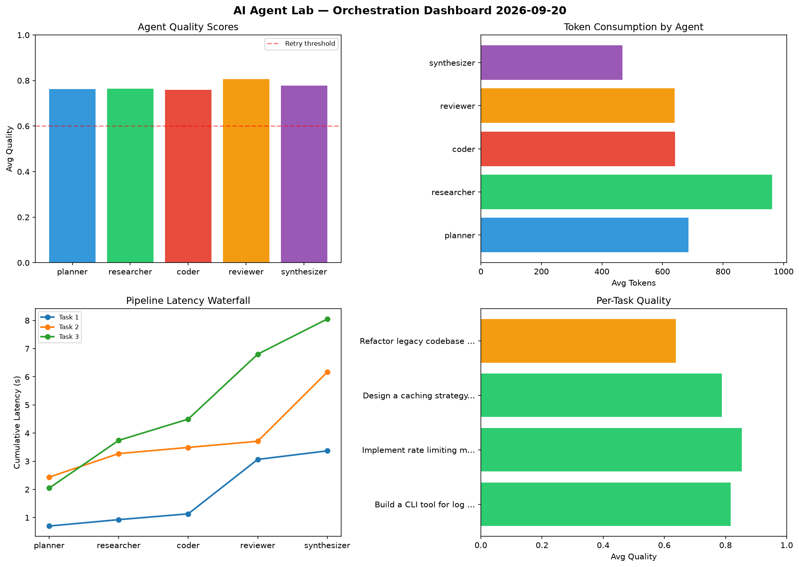

# AI Agent Lab — Orchestration Report 2026-09-20

**Run ID:** `067dcff51d` | **Tasks:** 4 | **Avg Quality:** 0.774

## Aggregate Metrics

| Metric | Value |
|--------|-------|
| avg_latency | 5.632 |
| total_tokens | 13592 |
| avg_quality | 0.774 |

## Delta vs Yesterday

| Metric | Today | Yesterday | Change |
|--------|-------|-----------|--------|
| avg_latency | 5.632 | 8.09 | 📉 -30.4% |
| total_tokens | 13592 | 14500 | 📉 -6.3% |
| avg_quality | 0.774 | 0.73 | 📈 6.0% |

## Pipeline Results

### Build a CLI tool for log analysis
| Agent | Quality | Latency | Tokens | Status |
|-------|---------|---------|--------|--------|
| planner | 0.954 | 0.7s | 406 | success |
| researcher | 0.791 | 0.227s | 1090 | success |
| coder | 0.568 | 0.206s | 888 | needs_retry |
| reviewer | 0.774 | 1.933s | 425 | success |
| synthesizer | 0.998 | 0.303s | 288 | success |

### Implement rate limiting middleware
| Agent | Quality | Latency | Tokens | Status |
|-------|---------|---------|--------|--------|
| planner | 0.716 | 2.437s | 860 | success |
| researcher | 0.859 | 0.836s | 1096 | success |
| coder | 0.931 | 0.218s | 740 | success |
| reviewer | 0.839 | 0.219s | 836 | success |
| synthesizer | 0.918 | 2.457s | 293 | success |

### Design a caching strategy for high-traffic endpoints
| Agent | Quality | Latency | Tokens | Status |
|-------|---------|---------|--------|--------|
| planner | 0.725 | 2.047s | 669 | success |
| researcher | 0.774 | 1.695s | 616 | success |
| coder | 0.972 | 0.755s | 574 | success |
| reviewer | 0.852 | 2.306s | 738 | success |
| synthesizer | 0.616 | 1.248s | 759 | success |

### Refactor legacy codebase to use dependency injection
| Agent | Quality | Latency | Tokens | Status |
|-------|---------|---------|--------|--------|
| planner | 0.658 | 1.081s | 809 | success |
| researcher | 0.631 | 0.116s | 1046 | success |
| coder | 0.563 | 0.548s | 365 | needs_retry |
| reviewer | 0.763 | 1.879s | 564 | success |
| synthesizer | 0.576 | 1.318s | 530 | needs_retry |
