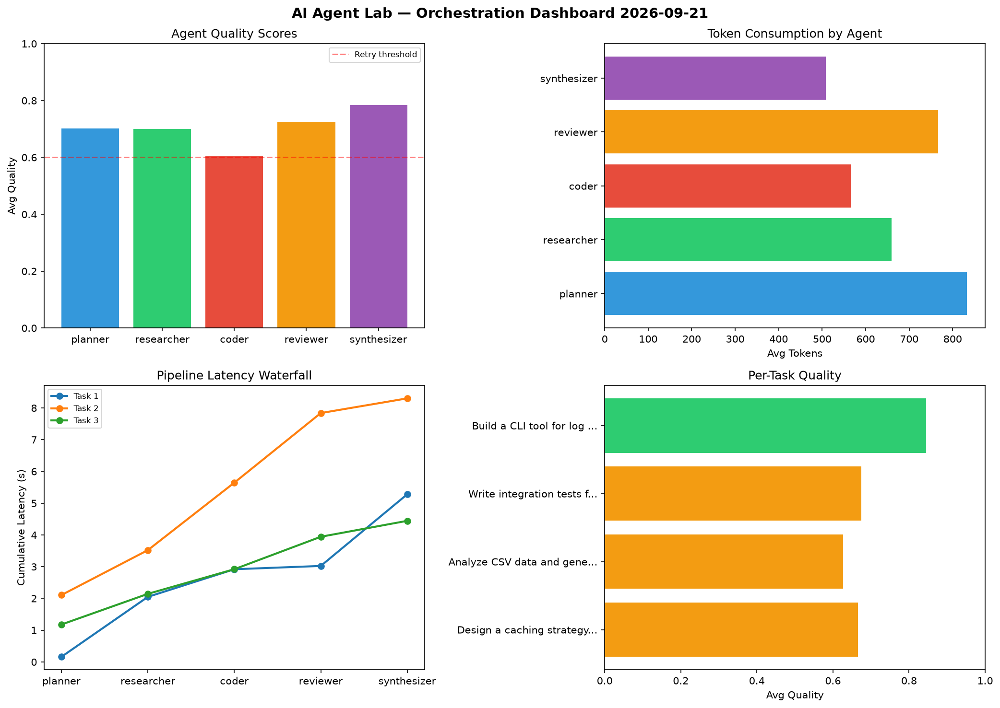

# AI Agent Lab — Orchestration Report 2026-09-21

**Run ID:** `1febaf0a73` | **Tasks:** 4 | **Avg Quality:** 0.703

## Aggregate Metrics

| Metric | Value |
|--------|-------|
| avg_latency | 5.766 |
| total_tokens | 13325 |
| avg_quality | 0.703 |

## Delta vs Yesterday

| Metric | Today | Yesterday | Change |
|--------|-------|-----------|--------|
| avg_latency | 5.766 | 6.5 | 📉 -11.3% |
| total_tokens | 13325 | 14025 | 📉 -5.0% |
| avg_quality | 0.703 | 0.736 | 📉 -4.5% |

## Pipeline Results

### Design a caching strategy for high-traffic endpoints
| Agent | Quality | Latency | Tokens | Status |
|-------|---------|---------|--------|--------|
| planner | 0.599 | 0.161s | 923 | needs_retry |
| researcher | 0.909 | 1.889s | 513 | success |
| coder | 0.592 | 0.87s | 755 | needs_retry |
| reviewer | 0.635 | 0.104s | 386 | success |
| synthesizer | 0.594 | 2.257s | 516 | needs_retry |

### Analyze CSV data and generate statistical summary
| Agent | Quality | Latency | Tokens | Status |
|-------|---------|---------|--------|--------|
| planner | 0.501 | 2.107s | 750 | needs_retry |
| researcher | 0.529 | 1.415s | 877 | needs_retry |
| coder | 0.519 | 2.125s | 490 | needs_retry |
| reviewer | 0.681 | 2.192s | 819 | success |
| synthesizer | 0.904 | 0.463s | 371 | success |

### Write integration tests for payment processing module
| Agent | Quality | Latency | Tokens | Status |
|-------|---------|---------|--------|--------|
| planner | 0.791 | 1.179s | 560 | success |
| researcher | 0.555 | 0.966s | 797 | needs_retry |
| coder | 0.59 | 0.776s | 441 | needs_retry |
| reviewer | 0.615 | 1.022s | 1054 | success |
| synthesizer | 0.821 | 0.502s | 622 | success |

### Build a CLI tool for log analysis
| Agent | Quality | Latency | Tokens | Status |
|-------|---------|---------|--------|--------|
| planner | 0.914 | 1.279s | 1099 | success |
| researcher | 0.805 | 0.23s | 449 | success |
| coder | 0.713 | 1.156s | 575 | success |
| reviewer | 0.974 | 1.331s | 805 | success |
| synthesizer | 0.819 | 1.042s | 523 | success |
