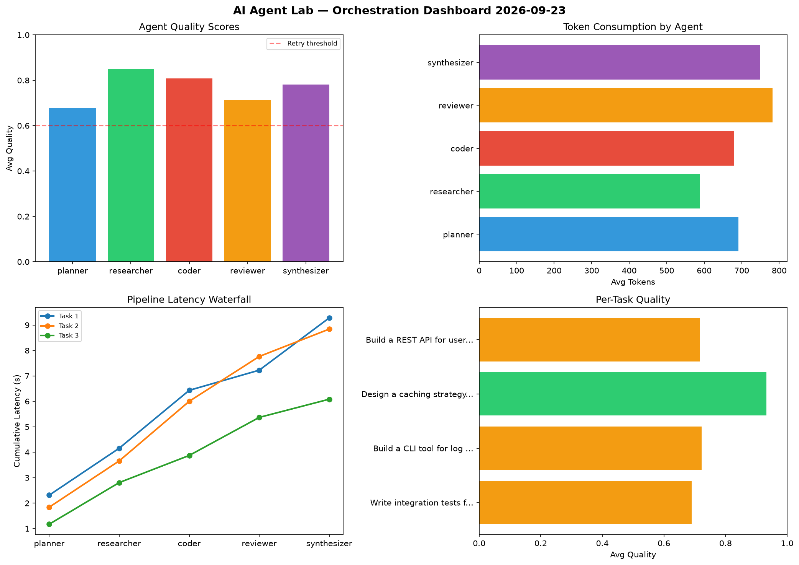

# AI Agent Lab — Orchestration Report 2026-09-23

**Run ID:** `0116b62a90` | **Tasks:** 4 | **Avg Quality:** 0.766

## Aggregate Metrics

| Metric | Value |
|--------|-------|
| avg_latency | 7.238 |
| total_tokens | 13957 |
| avg_quality | 0.766 |

## Delta vs Yesterday

| Metric | Today | Yesterday | Change |
|--------|-------|-----------|--------|
| avg_latency | 7.238 | 5.865 | 📈 23.4% |
| total_tokens | 13957 | 14943 | 📉 -6.6% |
| avg_quality | 0.766 | 0.762 | 📈 0.5% |

## Pipeline Results

### Write integration tests for payment processing module
| Agent | Quality | Latency | Tokens | Status |
|-------|---------|---------|--------|--------|
| planner | 0.563 | 2.314s | 513 | needs_retry |
| researcher | 0.627 | 1.845s | 692 | success |
| coder | 0.935 | 2.274s | 562 | success |
| reviewer | 0.512 | 0.792s | 1050 | needs_retry |
| synthesizer | 0.811 | 2.054s | 713 | success |

### Build a CLI tool for log analysis
| Agent | Quality | Latency | Tokens | Status |
|-------|---------|---------|--------|--------|
| planner | 0.597 | 1.841s | 998 | needs_retry |
| researcher | 0.924 | 1.82s | 770 | success |
| coder | 0.776 | 2.34s | 991 | success |
| reviewer | 0.611 | 1.762s | 310 | success |
| synthesizer | 0.703 | 1.076s | 772 | success |

### Design a caching strategy for high-traffic endpoints
| Agent | Quality | Latency | Tokens | Status |
|-------|---------|---------|--------|--------|
| planner | 0.966 | 1.173s | 502 | success |
| researcher | 0.994 | 1.635s | 528 | success |
| coder | 0.753 | 1.066s | 817 | success |
| reviewer | 0.973 | 1.495s | 771 | success |
| synthesizer | 0.98 | 0.715s | 598 | success |

### Build a REST API for user authentication
| Agent | Quality | Latency | Tokens | Status |
|-------|---------|---------|--------|--------|
| planner | 0.584 | 0.677s | 753 | needs_retry |
| researcher | 0.852 | 0.593s | 362 | success |
| coder | 0.769 | 1.0s | 348 | success |
| reviewer | 0.755 | 0.462s | 997 | success |
| synthesizer | 0.628 | 2.018s | 910 | success |
