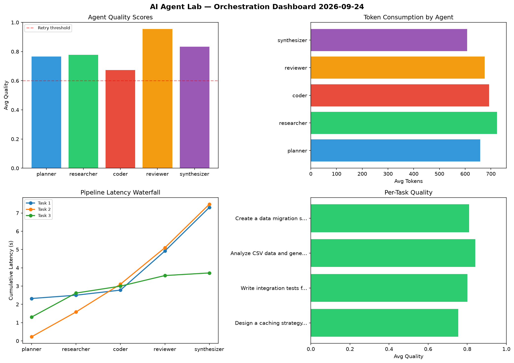

# AI Agent Lab — Orchestration Report 2026-09-24

**Run ID:** `eabd36dda2` | **Tasks:** 4 | **Avg Quality:** 0.801

## Aggregate Metrics

| Metric | Value |
|--------|-------|
| avg_latency | 6.285 |
| total_tokens | 13437 |
| avg_quality | 0.801 |

## Delta vs Yesterday

| Metric | Today | Yesterday | Change |
|--------|-------|-----------|--------|
| avg_latency | 6.285 | 7.509 | 📉 -16.3% |
| total_tokens | 13437 | 14946 | 📉 -10.1% |
| avg_quality | 0.801 | 0.7 | 📈 14.4% |

## Pipeline Results

### Design a caching strategy for high-traffic endpoints
| Agent | Quality | Latency | Tokens | Status |
|-------|---------|---------|--------|--------|
| planner | 0.804 | 2.32s | 873 | success |
| researcher | 0.68 | 0.18s | 930 | success |
| coder | 0.618 | 0.279s | 666 | success |
| reviewer | 0.916 | 2.139s | 996 | success |
| synthesizer | 0.751 | 2.386s | 854 | success |

### Write integration tests for payment processing module
| Agent | Quality | Latency | Tokens | Status |
|-------|---------|---------|--------|--------|
| planner | 0.654 | 0.225s | 327 | success |
| researcher | 0.749 | 1.358s | 594 | success |
| coder | 0.624 | 1.521s | 897 | success |
| reviewer | 0.993 | 1.997s | 286 | success |
| synthesizer | 0.987 | 2.377s | 323 | success |

### Analyze CSV data and generate statistical summary
| Agent | Quality | Latency | Tokens | Status |
|-------|---------|---------|--------|--------|
| planner | 0.951 | 1.303s | 700 | success |
| researcher | 0.759 | 1.315s | 752 | success |
| coder | 0.656 | 0.378s | 295 | success |
| reviewer | 0.913 | 0.58s | 983 | success |
| synthesizer | 0.927 | 0.143s | 782 | success |

### Create a data migration script for schema v2
| Agent | Quality | Latency | Tokens | Status |
|-------|---------|---------|--------|--------|
| planner | 0.654 | 0.699s | 734 | success |
| researcher | 0.925 | 1.778s | 620 | success |
| coder | 0.798 | 0.217s | 915 | success |
| reviewer | 0.999 | 2.234s | 439 | success |
| synthesizer | 0.668 | 1.709s | 471 | success |
