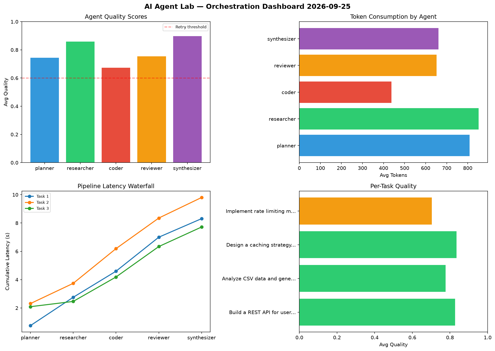

# AI Agent Lab — Orchestration Report 2026-09-25

**Run ID:** `40eee0f404` | **Tasks:** 4 | **Avg Quality:** 0.786

## Aggregate Metrics

| Metric | Value |
|--------|-------|
| avg_latency | 7.859 |
| total_tokens | 13645 |
| avg_quality | 0.786 |

## Delta vs Yesterday

| Metric | Today | Yesterday | Change |
|--------|-------|-----------|--------|
| avg_latency | 7.859 | 6.566 | 📈 19.7% |
| total_tokens | 13645 | 14220 | 📉 -4.0% |
| avg_quality | 0.786 | 0.754 | 📈 4.2% |

## Pipeline Results

### Build a REST API for user authentication
| Agent | Quality | Latency | Tokens | Status |
|-------|---------|---------|--------|--------|
| planner | 0.844 | 0.754s | 855 | success |
| researcher | 0.842 | 2.001s | 1211 | success |
| coder | 0.831 | 1.841s | 393 | success |
| reviewer | 0.618 | 2.403s | 484 | success |
| synthesizer | 1.0 | 1.309s | 389 | success |

### Analyze CSV data and generate statistical summary
| Agent | Quality | Latency | Tokens | Status |
|-------|---------|---------|--------|--------|
| planner | 0.576 | 2.311s | 497 | needs_retry |
| researcher | 0.883 | 1.429s | 711 | success |
| coder | 0.763 | 2.45s | 248 | success |
| reviewer | 0.793 | 2.161s | 489 | success |
| synthesizer | 0.868 | 1.451s | 564 | success |

### Design a caching strategy for high-traffic endpoints
| Agent | Quality | Latency | Tokens | Status |
|-------|---------|---------|--------|--------|
| planner | 0.734 | 2.092s | 958 | success |
| researcher | 0.994 | 0.371s | 864 | success |
| coder | 0.574 | 1.725s | 882 | needs_retry |
| reviewer | 0.912 | 2.15s | 621 | success |
| synthesizer | 0.961 | 1.38s | 756 | success |

### Implement rate limiting middleware
| Agent | Quality | Latency | Tokens | Status |
|-------|---------|---------|--------|--------|
| planner | 0.822 | 0.169s | 924 | success |
| researcher | 0.717 | 1.194s | 622 | success |
| coder | 0.523 | 1.011s | 228 | needs_retry |
| reviewer | 0.694 | 1.463s | 1014 | success |
| synthesizer | 0.763 | 1.771s | 935 | success |
