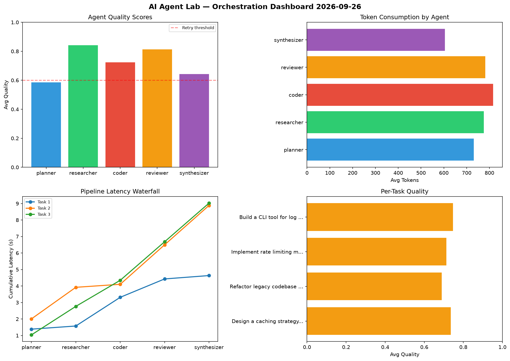

# AI Agent Lab — Orchestration Report 2026-09-26

**Run ID:** `0abaaa3280` | **Tasks:** 4 | **Avg Quality:** 0.721

## Aggregate Metrics

| Metric | Value |
|--------|-------|
| avg_latency | 7.634 |
| total_tokens | 14835 |
| avg_quality | 0.721 |

## Delta vs Yesterday

| Metric | Today | Yesterday | Change |
|--------|-------|-----------|--------|
| avg_latency | 7.634 | 6.297 | 📈 21.2% |
| total_tokens | 14835 | 15175 | 📉 -2.2% |
| avg_quality | 0.721 | 0.733 | 📉 -1.6% |

## Pipeline Results

### Design a caching strategy for high-traffic endpoints
| Agent | Quality | Latency | Tokens | Status |
|-------|---------|---------|--------|--------|
| planner | 0.555 | 1.385s | 790 | needs_retry |
| researcher | 0.756 | 0.191s | 952 | success |
| coder | 0.952 | 1.738s | 948 | success |
| reviewer | 0.568 | 1.115s | 555 | needs_retry |
| synthesizer | 0.851 | 0.204s | 381 | success |

### Refactor legacy codebase to use dependency injection
| Agent | Quality | Latency | Tokens | Status |
|-------|---------|---------|--------|--------|
| planner | 0.5 | 2.005s | 897 | needs_retry |
| researcher | 0.749 | 1.916s | 751 | success |
| coder | 0.757 | 0.182s | 470 | success |
| reviewer | 0.914 | 2.394s | 824 | success |
| synthesizer | 0.53 | 2.385s | 878 | needs_retry |

### Implement rate limiting middleware
| Agent | Quality | Latency | Tokens | Status |
|-------|---------|---------|--------|--------|
| planner | 0.529 | 1.036s | 797 | needs_retry |
| researcher | 0.899 | 1.729s | 466 | success |
| coder | 0.577 | 1.58s | 1042 | needs_retry |
| reviewer | 0.976 | 2.337s | 1247 | success |
| synthesizer | 0.582 | 2.341s | 915 | needs_retry |

### Build a CLI tool for log analysis
| Agent | Quality | Latency | Tokens | Status |
|-------|---------|---------|--------|--------|
| planner | 0.757 | 0.955s | 439 | success |
| researcher | 0.963 | 2.088s | 934 | success |
| coder | 0.609 | 2.022s | 804 | success |
| reviewer | 0.794 | 2.369s | 499 | success |
| synthesizer | 0.61 | 0.564s | 246 | success |
