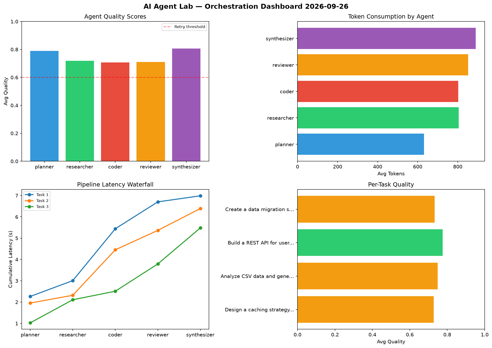

# AI Agent Lab — Orchestration Report 2026-09-26

**Run ID:** `4da9b85c29` | **Tasks:** 4 | **Avg Quality:** 0.774

## Aggregate Metrics

| Metric | Value |
|--------|-------|
| avg_latency | 5.245 |
| total_tokens | 16316 |
| avg_quality | 0.774 |

## Delta vs Yesterday

| Metric | Today | Yesterday | Change |
|--------|-------|-----------|--------|
| avg_latency | 5.245 | 6.297 | 📉 -16.7% |
| total_tokens | 16316 | 15175 | 📈 7.5% |
| avg_quality | 0.774 | 0.733 | 📈 5.6% |

## Pipeline Results

### Create a data migration script for schema v2
| Agent | Quality | Latency | Tokens | Status |
|-------|---------|---------|--------|--------|
| planner | 0.911 | 0.77s | 654 | success |
| researcher | 0.858 | 1.599s | 1104 | success |
| coder | 0.785 | 1.048s | 396 | success |
| reviewer | 0.573 | 0.233s | 226 | needs_retry |
| synthesizer | 0.85 | 1.957s | 428 | success |

### Analyze CSV data and generate statistical summary
| Agent | Quality | Latency | Tokens | Status |
|-------|---------|---------|--------|--------|
| planner | 0.569 | 1.128s | 432 | needs_retry |
| researcher | 0.56 | 2.472s | 500 | needs_retry |
| coder | 0.687 | 0.517s | 948 | success |
| reviewer | 0.781 | 0.507s | 810 | success |
| synthesizer | 0.861 | 1.201s | 577 | success |

### Implement rate limiting middleware
| Agent | Quality | Latency | Tokens | Status |
|-------|---------|---------|--------|--------|
| planner | 0.905 | 0.15s | 1200 | success |
| researcher | 0.885 | 1.947s | 1288 | success |
| coder | 0.728 | 0.646s | 1049 | success |
| reviewer | 0.533 | 0.988s | 867 | needs_retry |
| synthesizer | 0.893 | 0.18s | 1247 | success |

### Build a REST API for user authentication
| Agent | Quality | Latency | Tokens | Status |
|-------|---------|---------|--------|--------|
| planner | 0.875 | 1.415s | 901 | success |
| researcher | 0.732 | 1.621s | 1097 | success |
| coder | 0.981 | 0.971s | 1183 | success |
| reviewer | 0.986 | 1.106s | 735 | success |
| synthesizer | 0.514 | 0.522s | 674 | needs_retry |
