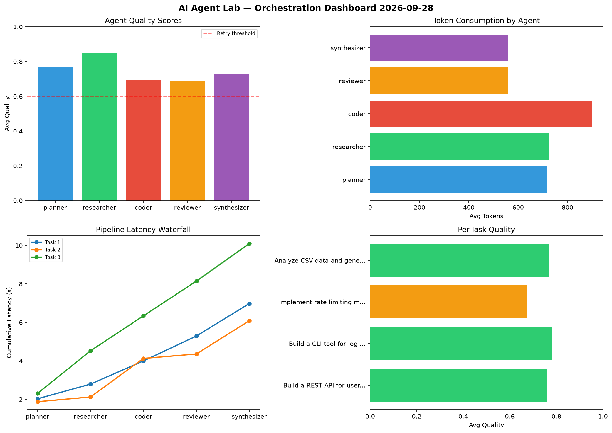

# AI Agent Lab — Orchestration Report 2026-09-28

**Run ID:** `6746d42fb1` | **Tasks:** 4 | **Avg Quality:** 0.746

## Aggregate Metrics

| Metric | Value |
|--------|-------|
| avg_latency | 7.312 |
| total_tokens | 13840 |
| avg_quality | 0.746 |

## Delta vs Yesterday

| Metric | Today | Yesterday | Change |
|--------|-------|-----------|--------|
| avg_latency | 7.312 | 6.62 | 📈 10.5% |
| total_tokens | 13840 | 15658 | 📉 -11.6% |
| avg_quality | 0.746 | 0.755 | 📉 -1.2% |

## Pipeline Results

### Build a REST API for user authentication
| Agent | Quality | Latency | Tokens | Status |
|-------|---------|---------|--------|--------|
| planner | 0.891 | 2.025s | 875 | success |
| researcher | 0.806 | 0.762s | 407 | success |
| coder | 0.785 | 1.206s | 590 | success |
| reviewer | 0.641 | 1.293s | 608 | success |
| synthesizer | 0.671 | 1.689s | 886 | success |

### Build a CLI tool for log analysis
| Agent | Quality | Latency | Tokens | Status |
|-------|---------|---------|--------|--------|
| planner | 0.935 | 1.872s | 920 | success |
| researcher | 0.938 | 0.246s | 845 | success |
| coder | 0.712 | 2.005s | 1120 | success |
| reviewer | 0.53 | 0.23s | 822 | needs_retry |
| synthesizer | 0.789 | 1.727s | 522 | success |

### Implement rate limiting middleware
| Agent | Quality | Latency | Tokens | Status |
|-------|---------|---------|--------|--------|
| planner | 0.566 | 2.306s | 712 | needs_retry |
| researcher | 0.667 | 2.213s | 580 | success |
| coder | 0.573 | 1.817s | 893 | needs_retry |
| reviewer | 0.815 | 1.806s | 432 | success |
| synthesizer | 0.757 | 1.951s | 191 | success |

### Analyze CSV data and generate statistical summary
| Agent | Quality | Latency | Tokens | Status |
|-------|---------|---------|--------|--------|
| planner | 0.685 | 1.782s | 368 | success |
| researcher | 0.974 | 1.382s | 1073 | success |
| coder | 0.702 | 0.683s | 992 | success |
| reviewer | 0.774 | 1.937s | 372 | success |
| synthesizer | 0.703 | 0.316s | 632 | success |
