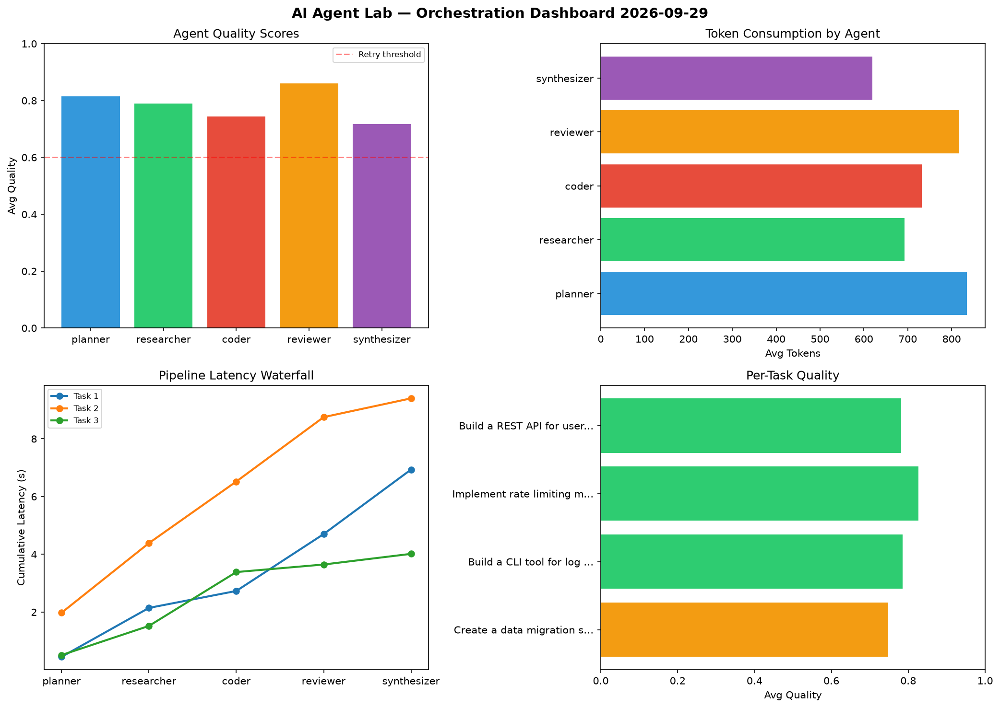

# AI Agent Lab — Orchestration Report 2026-09-29

**Run ID:** `4526dbc321` | **Tasks:** 4 | **Avg Quality:** 0.785

## Aggregate Metrics

| Metric | Value |
|--------|-------|
| avg_latency | 7.226 |
| total_tokens | 14785 |
| avg_quality | 0.785 |

## Delta vs Yesterday

| Metric | Today | Yesterday | Change |
|--------|-------|-----------|--------|
| avg_latency | 7.226 | 7.312 | 📉 -1.2% |
| total_tokens | 14785 | 13840 | 📈 6.8% |
| avg_quality | 0.785 | 0.746 | 📈 5.2% |

## Pipeline Results

### Create a data migration script for schema v2
| Agent | Quality | Latency | Tokens | Status |
|-------|---------|---------|--------|--------|
| planner | 0.521 | 0.449s | 630 | needs_retry |
| researcher | 0.927 | 1.695s | 970 | success |
| coder | 0.923 | 0.587s | 408 | success |
| reviewer | 0.813 | 1.97s | 873 | success |
| synthesizer | 0.554 | 2.234s | 962 | needs_retry |

### Build a CLI tool for log analysis
| Agent | Quality | Latency | Tokens | Status |
|-------|---------|---------|--------|--------|
| planner | 0.889 | 1.977s | 1053 | success |
| researcher | 0.565 | 2.411s | 569 | needs_retry |
| coder | 0.779 | 2.133s | 1036 | success |
| reviewer | 0.91 | 2.23s | 772 | success |
| synthesizer | 0.783 | 0.65s | 592 | success |

### Implement rate limiting middleware
| Agent | Quality | Latency | Tokens | Status |
|-------|---------|---------|--------|--------|
| planner | 0.932 | 0.511s | 1047 | success |
| researcher | 0.718 | 1.009s | 877 | success |
| coder | 0.761 | 1.865s | 658 | success |
| reviewer | 0.763 | 0.262s | 698 | success |
| synthesizer | 0.954 | 0.369s | 378 | success |

### Build a REST API for user authentication
| Agent | Quality | Latency | Tokens | Status |
|-------|---------|---------|--------|--------|
| planner | 0.917 | 2.158s | 609 | success |
| researcher | 0.948 | 1.857s | 354 | success |
| coder | 0.515 | 1.392s | 828 | needs_retry |
| reviewer | 0.955 | 2.017s | 926 | success |
| synthesizer | 0.575 | 1.129s | 545 | needs_retry |
