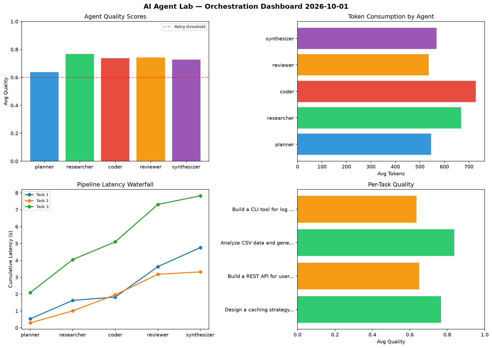

# AI Agent Lab — Orchestration Report 2026-10-01

**Run ID:** `1eaf8fcd15` | **Tasks:** 4 | **Avg Quality:** 0.723

## Aggregate Metrics

| Metric | Value |
|--------|-------|
| avg_latency | 5.778 |
| total_tokens | 12188 |
| avg_quality | 0.723 |

## Delta vs Yesterday

| Metric | Today | Yesterday | Change |
|--------|-------|-----------|--------|
| avg_latency | 5.778 | 6.532 | 📉 -11.5% |
| total_tokens | 12188 | 15916 | 📉 -23.4% |
| avg_quality | 0.723 | 0.767 | 📉 -5.7% |

## Pipeline Results

### Design a caching strategy for high-traffic endpoints
| Agent | Quality | Latency | Tokens | Status |
|-------|---------|---------|--------|--------|
| planner | 0.593 | 0.536s | 609 | needs_retry |
| researcher | 0.88 | 1.091s | 511 | success |
| coder | 0.855 | 0.198s | 684 | success |
| reviewer | 0.883 | 1.802s | 248 | success |
| synthesizer | 0.622 | 1.131s | 243 | success |

### Build a REST API for user authentication
| Agent | Quality | Latency | Tokens | Status |
|-------|---------|---------|--------|--------|
| planner | 0.508 | 0.296s | 614 | needs_retry |
| researcher | 0.623 | 0.713s | 182 | success |
| coder | 0.587 | 0.951s | 442 | needs_retry |
| reviewer | 0.827 | 1.214s | 699 | success |
| synthesizer | 0.707 | 0.143s | 700 | success |

### Analyze CSV data and generate statistical summary
| Agent | Quality | Latency | Tokens | Status |
|-------|---------|---------|--------|--------|
| planner | 0.63 | 2.085s | 257 | success |
| researcher | 0.992 | 1.963s | 902 | success |
| coder | 0.97 | 1.051s | 1045 | success |
| reviewer | 0.631 | 2.215s | 339 | success |
| synthesizer | 0.962 | 0.512s | 816 | success |

### Build a CLI tool for log analysis
| Agent | Quality | Latency | Tokens | Status |
|-------|---------|---------|--------|--------|
| planner | 0.82 | 1.062s | 703 | success |
| researcher | 0.577 | 0.372s | 1079 | needs_retry |
| coder | 0.538 | 2.341s | 743 | needs_retry |
| reviewer | 0.625 | 2.086s | 859 | success |
| synthesizer | 0.621 | 1.351s | 513 | success |
