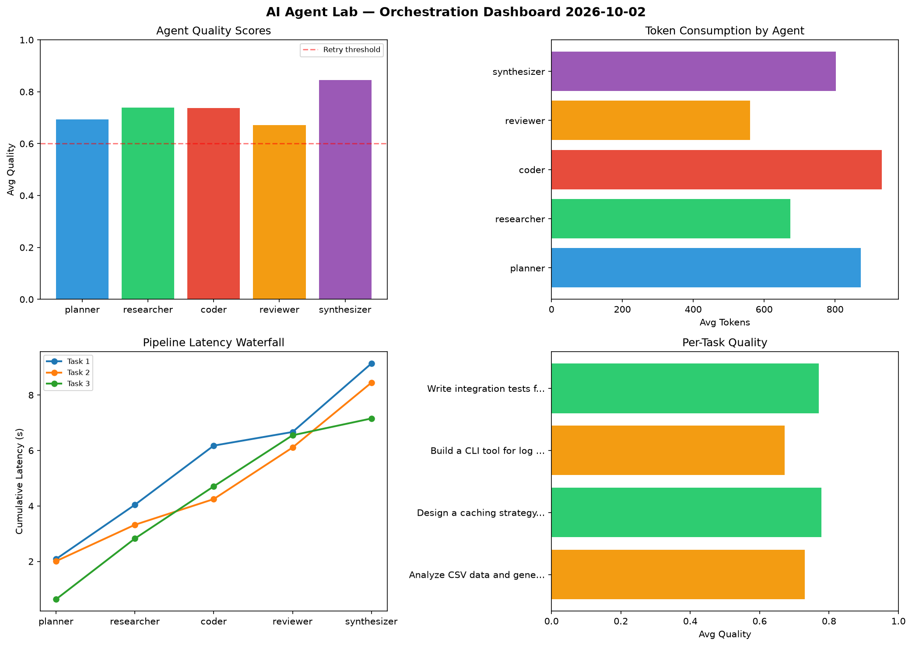

# AI Agent Lab — Orchestration Report 2026-10-02

**Run ID:** `d6aff583dd` | **Tasks:** 4 | **Avg Quality:** 0.738

## Aggregate Metrics

| Metric | Value |
|--------|-------|
| avg_latency | 7.87 |
| total_tokens | 15369 |
| avg_quality | 0.738 |

## Delta vs Yesterday

| Metric | Today | Yesterday | Change |
|--------|-------|-----------|--------|
| avg_latency | 7.87 | 7.255 | 📈 8.5% |
| total_tokens | 15369 | 13327 | 📈 15.3% |
| avg_quality | 0.738 | 0.736 | 📈 0.3% |

## Pipeline Results

### Analyze CSV data and generate statistical summary
| Agent | Quality | Latency | Tokens | Status |
|-------|---------|---------|--------|--------|
| planner | 0.665 | 2.084s | 696 | success |
| researcher | 0.612 | 1.957s | 372 | success |
| coder | 0.898 | 2.134s | 938 | success |
| reviewer | 0.668 | 0.492s | 512 | success |
| synthesizer | 0.807 | 2.47s | 880 | success |

### Design a caching strategy for high-traffic endpoints
| Agent | Quality | Latency | Tokens | Status |
|-------|---------|---------|--------|--------|
| planner | 0.709 | 2.008s | 848 | success |
| researcher | 0.682 | 1.312s | 610 | success |
| coder | 0.975 | 0.927s | 795 | success |
| reviewer | 0.751 | 1.86s | 936 | success |
| synthesizer | 0.773 | 2.338s | 675 | success |

### Build a CLI tool for log analysis
| Agent | Quality | Latency | Tokens | Status |
|-------|---------|---------|--------|--------|
| planner | 0.566 | 0.633s | 1041 | needs_retry |
| researcher | 0.744 | 2.19s | 1142 | success |
| coder | 0.533 | 1.882s | 1072 | needs_retry |
| reviewer | 0.561 | 1.843s | 226 | needs_retry |
| synthesizer | 0.956 | 0.606s | 513 | success |

### Write integration tests for payment processing module
| Agent | Quality | Latency | Tokens | Status |
|-------|---------|---------|--------|--------|
| planner | 0.833 | 0.491s | 908 | success |
| researcher | 0.92 | 2.103s | 572 | success |
| coder | 0.543 | 1.612s | 924 | needs_retry |
| reviewer | 0.708 | 1.029s | 568 | success |
| synthesizer | 0.846 | 1.508s | 1141 | success |
