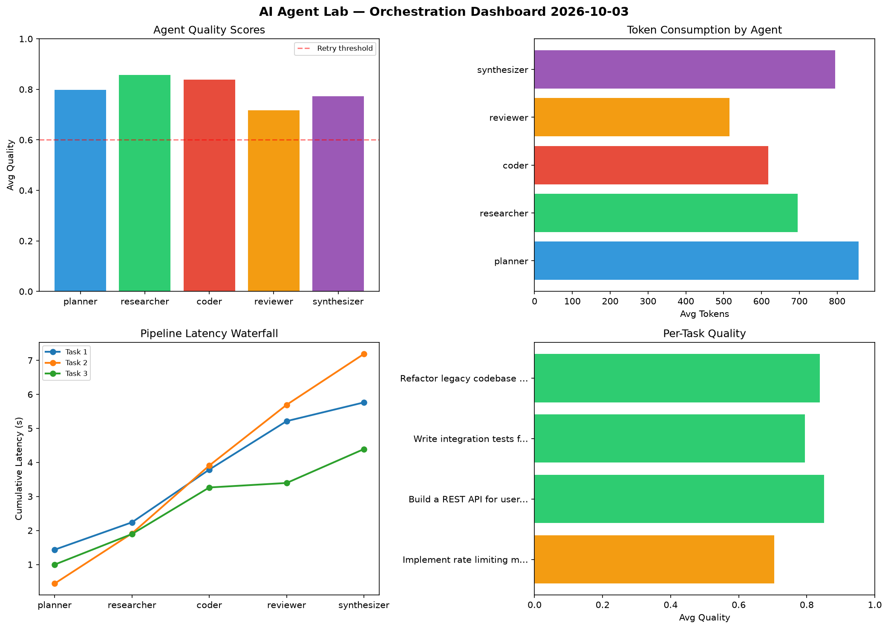

# AI Agent Lab — Orchestration Report 2026-10-03

**Run ID:** `011acaf139` | **Tasks:** 4 | **Avg Quality:** 0.797

## Aggregate Metrics

| Metric | Value |
|--------|-------|
| avg_latency | 5.922 |
| total_tokens | 13921 |
| avg_quality | 0.797 |

## Delta vs Yesterday

| Metric | Today | Yesterday | Change |
|--------|-------|-----------|--------|
| avg_latency | 5.922 | 5.512 | 📈 7.4% |
| total_tokens | 13921 | 13265 | 📈 4.9% |
| avg_quality | 0.797 | 0.804 | 📉 -0.9% |

## Pipeline Results

### Implement rate limiting middleware
| Agent | Quality | Latency | Tokens | Status |
|-------|---------|---------|--------|--------|
| planner | 0.651 | 1.436s | 868 | success |
| researcher | 0.95 | 0.804s | 513 | success |
| coder | 0.551 | 1.55s | 445 | needs_retry |
| reviewer | 0.631 | 1.423s | 436 | success |
| synthesizer | 0.737 | 0.55s | 953 | success |

### Build a REST API for user authentication
| Agent | Quality | Latency | Tokens | Status |
|-------|---------|---------|--------|--------|
| planner | 0.992 | 0.441s | 960 | success |
| researcher | 0.882 | 1.473s | 948 | success |
| coder | 0.813 | 1.995s | 831 | success |
| reviewer | 0.653 | 1.784s | 441 | success |
| synthesizer | 0.913 | 1.495s | 840 | success |

### Write integration tests for payment processing module
| Agent | Quality | Latency | Tokens | Status |
|-------|---------|---------|--------|--------|
| planner | 0.718 | 0.998s | 1055 | success |
| researcher | 0.776 | 0.898s | 843 | success |
| coder | 0.993 | 1.368s | 572 | success |
| reviewer | 0.632 | 0.132s | 563 | success |
| synthesizer | 0.855 | 0.996s | 811 | success |

### Refactor legacy codebase to use dependency injection
| Agent | Quality | Latency | Tokens | Status |
|-------|---------|---------|--------|--------|
| planner | 0.833 | 2.097s | 544 | success |
| researcher | 0.821 | 1.514s | 478 | success |
| coder | 0.994 | 2.192s | 622 | success |
| reviewer | 0.955 | 0.356s | 621 | success |
| synthesizer | 0.585 | 0.185s | 577 | needs_retry |
