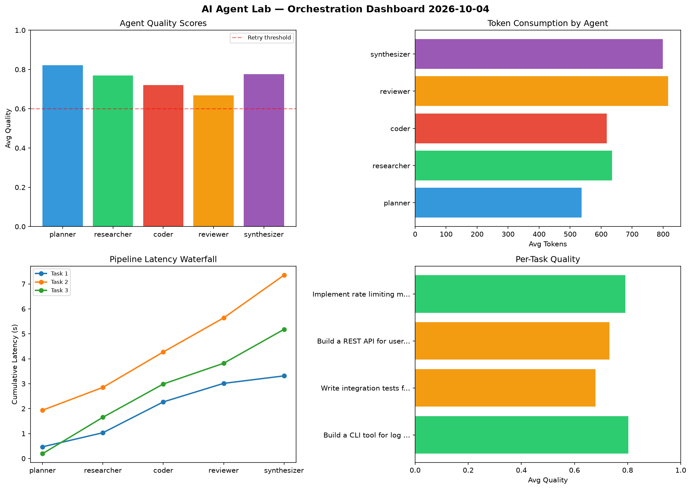

# AI Agent Lab — Orchestration Report 2026-10-04

**Run ID:** `21f3ce6577` | **Tasks:** 4 | **Avg Quality:** 0.752

## Aggregate Metrics

| Metric | Value |
|--------|-------|
| avg_latency | 5.399 |
| total_tokens | 13624 |
| avg_quality | 0.752 |

## Delta vs Yesterday

| Metric | Today | Yesterday | Change |
|--------|-------|-----------|--------|
| avg_latency | 5.399 | 6.051 | 📉 -10.8% |
| total_tokens | 13624 | 12701 | 📈 7.3% |
| avg_quality | 0.752 | 0.73 | 📈 3.0% |

## Pipeline Results

### Build a CLI tool for log analysis
| Agent | Quality | Latency | Tokens | Status |
|-------|---------|---------|--------|--------|
| planner | 0.936 | 0.468s | 509 | success |
| researcher | 0.648 | 0.565s | 584 | success |
| coder | 0.863 | 1.236s | 640 | success |
| reviewer | 0.828 | 0.743s | 823 | success |
| synthesizer | 0.74 | 0.301s | 1019 | success |

### Write integration tests for payment processing module
| Agent | Quality | Latency | Tokens | Status |
|-------|---------|---------|--------|--------|
| planner | 0.741 | 1.937s | 575 | success |
| researcher | 0.678 | 0.915s | 923 | success |
| coder | 0.714 | 1.42s | 813 | success |
| reviewer | 0.656 | 1.367s | 982 | success |
| synthesizer | 0.605 | 1.714s | 736 | success |

### Build a REST API for user authentication
| Agent | Quality | Latency | Tokens | Status |
|-------|---------|---------|--------|--------|
| planner | 0.81 | 0.193s | 310 | success |
| researcher | 0.816 | 1.46s | 502 | success |
| coder | 0.608 | 1.334s | 317 | success |
| reviewer | 0.626 | 0.831s | 633 | success |
| synthesizer | 0.799 | 1.36s | 866 | success |

### Implement rate limiting middleware
| Agent | Quality | Latency | Tokens | Status |
|-------|---------|---------|--------|--------|
| planner | 0.796 | 1.339s | 756 | success |
| researcher | 0.937 | 1.969s | 531 | success |
| coder | 0.7 | 1.045s | 702 | success |
| reviewer | 0.566 | 0.361s | 826 | needs_retry |
| synthesizer | 0.962 | 1.038s | 577 | success |
