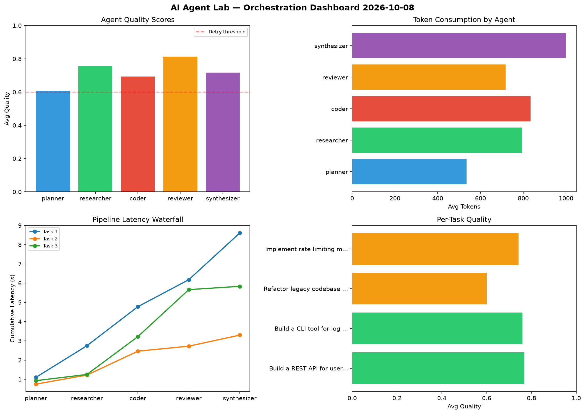

# AI Agent Lab — Orchestration Report 2026-10-08

**Run ID:** `45e801d903` | **Tasks:** 4 | **Avg Quality:** 0.718

## Aggregate Metrics

| Metric | Value |
|--------|-------|
| avg_latency | 6.089 |
| total_tokens | 15518 |
| avg_quality | 0.718 |

## Delta vs Yesterday

| Metric | Today | Yesterday | Change |
|--------|-------|-----------|--------|
| avg_latency | 6.089 | 6.847 | 📉 -11.1% |
| total_tokens | 15518 | 15380 | 📈 0.9% |
| avg_quality | 0.718 | 0.738 | 📉 -2.7% |

## Pipeline Results

### Build a REST API for user authentication
| Agent | Quality | Latency | Tokens | Status |
|-------|---------|---------|--------|--------|
| planner | 0.617 | 1.103s | 634 | success |
| researcher | 0.651 | 1.643s | 682 | success |
| coder | 0.857 | 2.03s | 675 | success |
| reviewer | 0.907 | 1.405s | 837 | success |
| synthesizer | 0.81 | 2.43s | 1021 | success |

### Build a CLI tool for log analysis
| Agent | Quality | Latency | Tokens | Status |
|-------|---------|---------|--------|--------|
| planner | 0.509 | 0.75s | 340 | needs_retry |
| researcher | 0.912 | 0.47s | 871 | success |
| coder | 0.838 | 1.243s | 625 | success |
| reviewer | 0.929 | 0.26s | 542 | success |
| synthesizer | 0.605 | 0.575s | 928 | success |

### Refactor legacy codebase to use dependency injection
| Agent | Quality | Latency | Tokens | Status |
|-------|---------|---------|--------|--------|
| planner | 0.704 | 0.929s | 956 | success |
| researcher | 0.577 | 0.322s | 545 | needs_retry |
| coder | 0.556 | 1.969s | 1181 | needs_retry |
| reviewer | 0.544 | 2.444s | 718 | needs_retry |
| synthesizer | 0.622 | 0.17s | 754 | success |

### Implement rate limiting middleware
| Agent | Quality | Latency | Tokens | Status |
|-------|---------|---------|--------|--------|
| planner | 0.601 | 1.97s | 211 | success |
| researcher | 0.885 | 0.789s | 1083 | success |
| coder | 0.526 | 1.621s | 854 | needs_retry |
| reviewer | 0.872 | 0.895s | 772 | success |
| synthesizer | 0.828 | 1.336s | 1289 | success |
